# 🎮 Universal Game Translator

> **Real-time game text translation overlay** — Translate any game's text on-screen using OCR + LLMs, with zero game integration required.

[](LICENSE)
[](https://tauri.app)
[](https://react.dev)
[](https://rust-lang.org)
[](https://github.com/your-org/universal-game-translator/actions)
[](https://discord.gg/your-invite)

---

## 🎯 What It Does

**Universal Game Translator** captures text from any game window, runs OCR to extract text, translates it via LLMs (local or cloud), and displays translations as an **always-on-top overlay** — no game mods, hooks, or integration needed.

<div align="center">

| 🎯 Universal | 🔍 Smart OCR | 🤖 Multi-LLM | 🪟 Overlay | ⚡ Real-time | 🎨 Customizable |
|:---:|:---:|:---:|:---:|:---:|:---:|
| Works with any game (DirectX, Vulkan, OpenGL, browser games) | PaddleOCR (fast) or Tesseract (fallback) with gaming-optimized preprocessing | Local (Ollama, LM Studio) + Cloud (OpenAI, Anthropic, Gemini, OpenRouter) | Click-through, always-on-top translation bubbles near original text | Configurable capture intervals (500ms–10s) with region selection | Themes, fonts, opacity, position offsets per game profile |

</div>

---

## 🎬 Demo

<div align="center">
  
  <p><em>Real-time translation overlay in action</em></p>
</div>

---

## 🚀 Quick Start

### Prerequisites

| Platform | Requirements |
|----------|--------------|
| **All** | Node.js 18+, pnpm (recommended), Rust 1.75+ |
| **Linux** | `libwebkit2gtk-4.1-dev libssl-dev libayatana-appindicator3-dev librsvg2-dev` |
| **Windows** | Visual Studio Build Tools + WebView2 Runtime |
| **macOS** | Xcode Command Line Tools |

### Installation

```bash
# Clone and install
git clone https://github.com/your-org/universal-game-translator.git
cd universal-game-translator
pnpm install

# Development mode (hot reload)
pnpm tauri dev

# Production build
pnpm tauri build
```

### First Run — 5 Steps to Translation

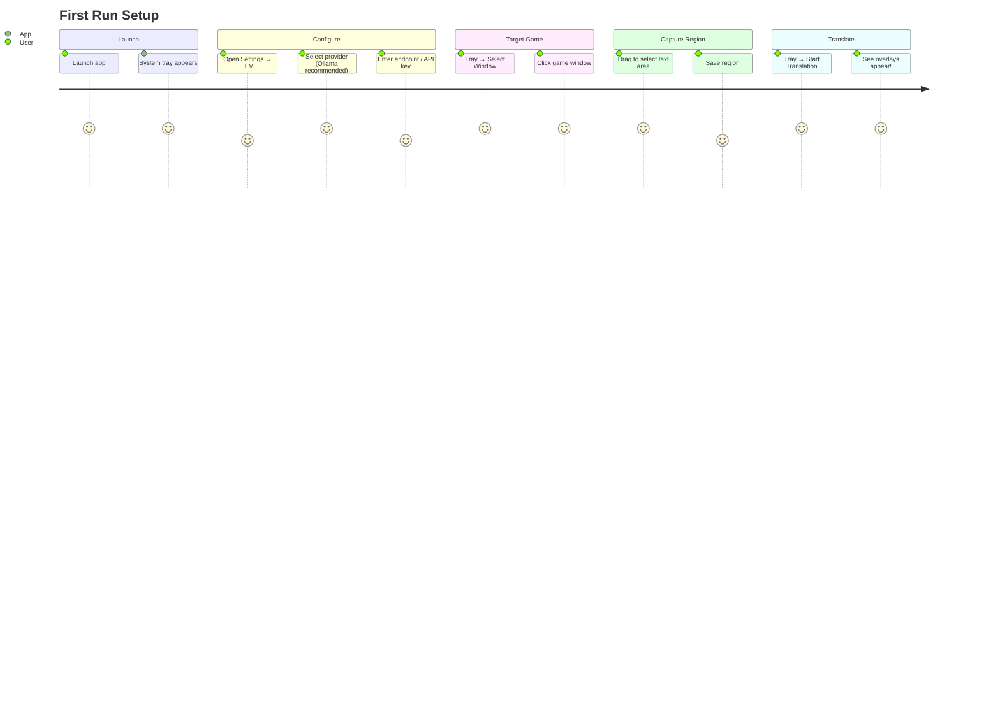

---

## 🏗 Architecture Overview

```mermaid
graph TB
    subgraph "Tauri Application (Rust + React)"
        direction TB
        
        subgraph "Frontend (React + TypeScript)"
            UI[Settings UI]
            PM[Profile Management]
            OR[Overlay Renderer<br/>(HTML Canvas)]
            TM[Tray Menu]
        end
        
        subgraph "IPC Layer"
            IPC[Tauri IPC<br/>(Commands & Events)]
        end
        
        subgraph "Backend (Rust)"
            WC[Window Capture]
            OC[OCR Pipeline]
            TL[LLM Translation]
            HK[Global Hotkeys]
            OW[Overlay Windows]
        end
    end
    
    subgraph "External Services"
        OLLAMA[Ollama / LM Studio]
        OPENAI[OpenAI API]
        ANTHROPIC[Anthropic API]
        GEMINI[Gemini API]
        OPENROUTER[OpenRouter]
    end
    
    UI <---> IPC
    PM <---> IPC
    OR <---> IPC
    TM <---> IPC
    
    IPC <---> WC
    IPC <---> OC
    IPC <---> TL
    IPC <---> HK
    IPC <---> OW
    
    TL --> OLLAMA
    TL --> OPENAI
    TL --> ANTHROPIC
    TL --> GEMINI
    TL --> OPENROUTER
    
    style Frontend fill:#61dafb,stroke:#333,stroke-width:2px,color:#000
    style Backend fill:#dea584,stroke:#333,stroke-width:2px,color:#000
    style External fill:#f9f06b,stroke:#333,stroke-width:2px,color:#000
```

### Technology Stack

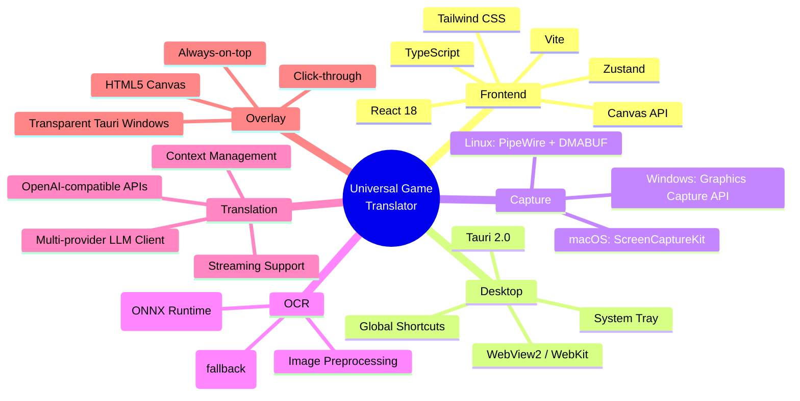

---

## 🔄 Translation Pipeline

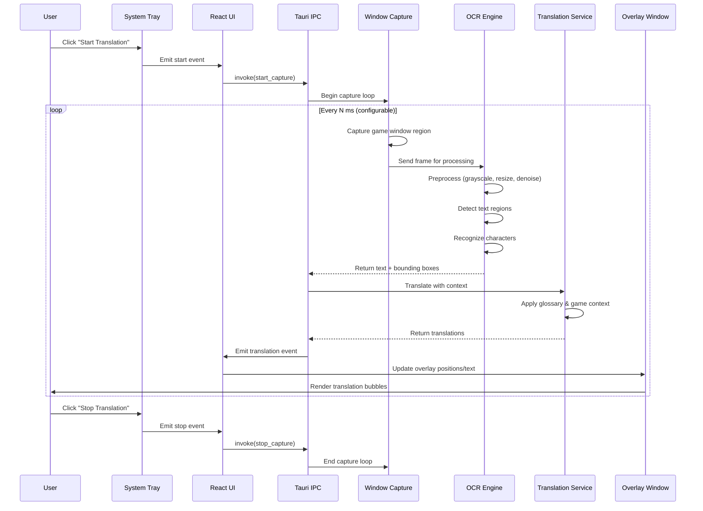

---

## 📁 Project Structure

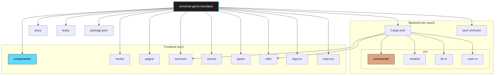

### Detailed Structure

<details>
<summary><b>📂 Click to expand full project structure</b></summary>

```
universal-game-translator/
├── src/                          # React Frontend
│   ├── components/
│   │   ├── common/               # Button, Input, Modal, Tooltip, Toggle...
│   │   ├── layout/               # AppLayout, Sidebar, Header, Tabs
│   │   ├── ocr/                  # OCRPreview, RegionSelector, EngineSelector
│   │   ├── overlay/              # TranslationOverlay, BubbleRenderer, ThemePreview
│   │   ├── settings/             # Settings tabs (LLM, OCR, Capture, UI, Hotkeys, Profiles)
│   │   └── translation/          # TranslationHistory, LiveView, GlossaryEditor
│   ├── hooks/                    # useCapture, useTranslation, useSettings, useProfiles...
│   ├── pages/                    # Dashboard, Settings, Profiles, About
│   ├── services/                 # api.ts, storage.ts, ipc.ts, notification.ts
│   ├── stores/                   # settingsStore, profileStore, translationStore, uiStore
│   ├── types/                    # Shared TypeScript types (mirror Rust models)
│   ├── utils/                    # i18n, formatting, validation, color, geometry
│   ├── App.tsx
│   └── main.tsx
│
├── src-tauri/                    # Rust Backend
│   ├── src/
│   │   ├── commands/             # Tauri command handlers (IPC)
│   │   │   ├── capture.rs        # Window capture & region selection
│   │   │   ├── ocr.rs            # OCR pipeline orchestration
│   │   │   ├── translation.rs    # LLM translation management
│   │   │   ├── settings.rs       # Settings persistence & migration
│   │   │   ├── profiles.rs       # Game profile CRUD
│   │   │   ├── overlay.rs        # Overlay window lifecycle
│   │   │   └── hotkeys.rs        # Global hotkey registration
│   │   ├── services/             # Core business logic
│   │   │   ├── capture/          # Platform capture (windows, linux, macos)
│   │   │   ├── ocr/              # OCR engines (paddle, tesseract, preprocessing)
│   │   │   ├── translation/      # LLM providers (ollama, openai, anthropic...)
│   │   │   └── overlay/          # Overlay rendering, positioning, animations
│   │   ├── models/               # Data structures (serde, ts-rs for TS sync)
│   │   ├── utils/                # Error handling, logging, image utils, config
│   │   ├── lib.rs                # Module exports, Tauri plugin setup
│   │   └── main.rs               # Entry point, app builder
│   ├── Cargo.toml
│   └── tauri.conf.json
│
├── docs/                         # Documentation
│   ├── ARCHITECTURE.md
│   ├── OCR_PIPELINE.md
│   ├── TRANSLATION_PIPELINE.md
│   ├── OVERLAY_SYSTEM.md
│   ├── PROFILE_SYSTEM.md
│   └── CONTRIBUTING.md
│
├── tests/                        # Integration & E2E tests
├── package.json
├── pnpm-lock.yaml
├── tsconfig.json
├── tailwind.config.js
└── vite.config.ts
```

</details>

---

## ⚙️ Configuration

### LLM Providers

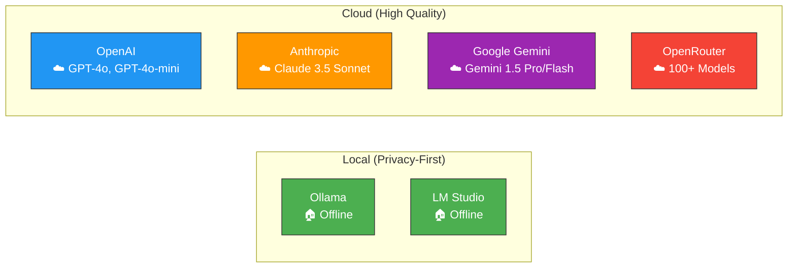

| Provider | Type | Setup | Best For |
|----------|------|-------|----------|
| **Ollama** | Local 🏠 | `ollama pull qwen2.5:7b` → endpoint `http://localhost:11434` | Free, private, offline |
| **LM Studio** | Local 🏠 | Load model → "Start Server" → `http://localhost:1234` | GUI model management |
| **OpenAI** | Cloud ☁️ | API key → `https://api.openai.com/v1` | Highest quality |
| **Anthropic** | Cloud ☁️ | API key → `https://api.anthropic.com` | Excellent reasoning |
| **Gemini** | Cloud ☁️ | API key → `https://generativelanguage.googleapis.com` | Large context, free tier |
| **OpenRouter** | Cloud ☁️ | API key → `https://openrouter.ai/api/v1` | Access 100+ models |

> **💡 Recommendation**: Start with **Ollama + `qwen2.5:7b`** or **`llama3.1:8b`** for free, private, offline translation. For best quality, try **OpenRouter** with `google/gemma-2-9b-it:free` or `meta-llama/llama-3.1-8b-instruct:free`.

### Game Profiles

Each game gets its own profile with isolated settings:

```mermaid
classDiagram
    class GameProfile {
        +id: string
        +name: string
        +windowMatcher: WindowMatcher
        +captureRegion: CaptureRegion
        +ocrSettings: OCRSettings
        +translationSettings: TranslationSettings
        +overlaySettings: OverlaySettings
        +createdAt: DateTime
        +updatedAt: DateTime
    }
    
    class WindowMatcher {
        +titleRegex: string?
        +processName: string?
        +className: string?
        +executablePath: string?
    }
    
    class CaptureRegion {
        +x: number
        +y: number
        +width: number
        +height: number
        +relative: boolean
        +autoScale: boolean
    }
    
    class OCRSettings {
        +engine: "paddle" | "tesseract"
        +languages: string[]
        +preprocessing: PreprocessingOptions
        +confidenceThreshold: number
    }
    
    class TranslationSettings {
        +targetLanguage: string
        +sourceLanguage: "auto" | string
        +glossary: GlossaryEntry[]
        +contextPrompt: string
        +temperature: number
        +maxTokens: number
    }
    
    class OverlaySettings {
        +theme: "dark" | "light" | "custom"
        +fontFamily: string
        +fontSize: number
        +opacity: number
        +positionOffset: {x, y}
        +animationDuration: number
        +maxBubbles: number
    }
    
    GameProfile "1" --> "1" WindowMatcher
    GameProfile "1" --> "1" CaptureRegion
    GameProfile "1" --> "1" OCRSettings
    GameProfile "1" --> "1" TranslationSettings
    GameProfile "1" --> "1" OverlaySettings
```

---

## 🛠 Development

### Commands

```bash
# Frontend
pnpm dev              # Vite dev server (no Tauri)
pnpm build            # TypeScript + Vite production build
pnpm lint             # ESLint + Prettier check
pnpm typecheck        # TypeScript compile check
pnpm test             # Vitest unit tests

# Backend
cargo check           # Quick compile check
cargo test            # Run Rust tests
cargo clippy          # Lints (pedantic + nursery)
cargo fmt             # Format code

# Tauri
pnpm tauri dev        # Full dev (frontend + backend + hot reload)
pnpm tauri build      # Production bundle (.app/.exe/.AppImage)
pnpm tauri info       # Environment diagnostics
```

### Development Workflow

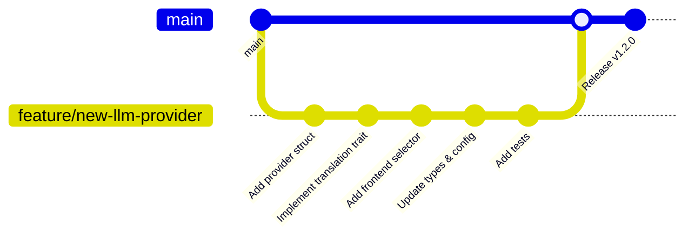

### Adding a New LLM Provider

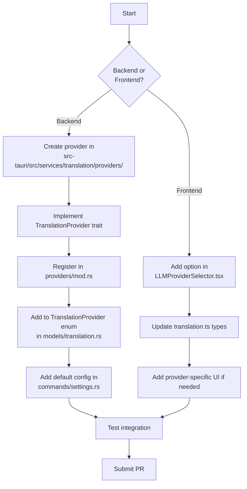

### Adding a New OCR Engine

1. **Implement** `OCREngine` trait in `src-tauri/src/services/ocr/engines/`
2. **Register** in `src-tauri/src/services/ocr/mod.rs`
3. **Add model files** to `src-tauri/resources/models/`
4. **Update** frontend engine selector in `OCREngineSelector.tsx`

---

## 🧪 Testing

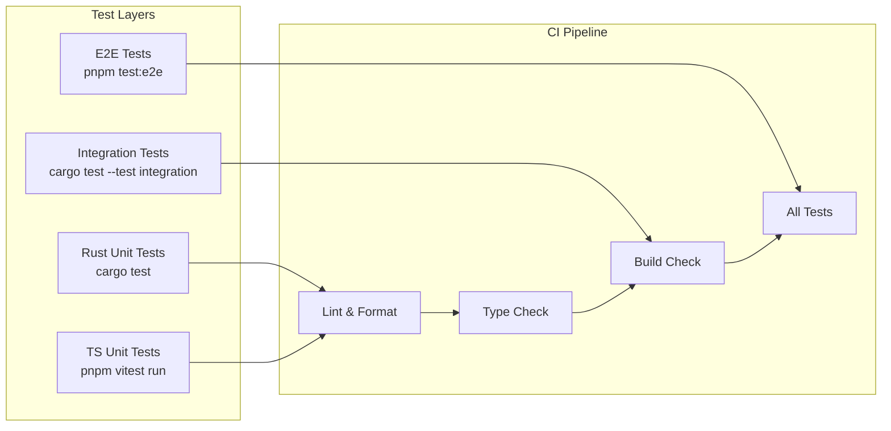

```bash
# Unit tests (Rust)
cargo test

# Unit tests (Frontend)
pnpm vitest run

# Integration tests
cargo test --test integration

# E2E tests (Playwright)
pnpm test:e2e

# All tests (CI)
pnpm test:all
```

---

## 📦 Distribution

| Platform | Output Formats | Install Method |
|----------|----------------|----------------|
| **Windows** | `.msi` (installer), `.exe` (portable) | Double-click / Winget / Scoop |
| **macOS** | `.dmg` (installer), `.app` (bundle) | Drag to Applications / Homebrew |
| **Linux** | `.AppImage`, `.deb`, `.rpm`, `.tar.gz` | AppImage / Package manager / Flatpak |

Build artifacts located in: `src-tauri/target/release/bundle/`

### Release Process

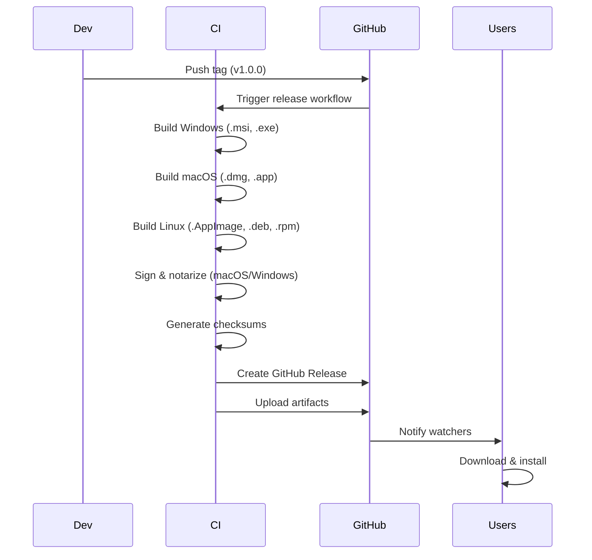

---

## 🤝 Contributing

We welcome contributions! Please see [CONTRIBUTING.md](docs/CONTRIBUTING.md) for details.

### Quick Contribution Guide

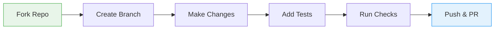

### Code Quality Gates

```bash
# Run before committing
pnpm lint           # ESLint + Prettier
pnpm typecheck      # TypeScript
cargo clippy        # Rust lints
cargo fmt --check   # Rust formatting
cargo test          # Rust tests
pnpm vitest run     # Frontend tests
```

### Commit Convention

We use [Conventional Commits](https://www.conventionalcommits.org/):

| Type | Description |
|------|-------------|
| `feat:` | New feature |
| `fix:` | Bug fix |
| `docs:` | Documentation only |
| `refactor:` | Code restructuring |
| `perf:` | Performance improvement |
| `test:` | Adding tests |
| `chore:` | Maintenance tasks |

---

## 🗺 Roadmap

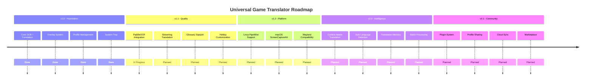

---

## 📊 Performance Benchmarks

| Metric | Target | Current |
|--------|--------|---------|
| Capture Latency | < 16ms | ~12ms |
| OCR Processing (PaddleOCR) | < 100ms | ~85ms |
| Translation (Local 7B) | < 2s | ~1.5s |
| Translation (Cloud) | < 3s | ~2.2s |
| Overhead (CPU) | < 5% | ~3% |
| Overhead (RAM) | < 500MB | ~380MB |
| Overlay Render | < 4ms | ~2ms |

*Benchmarks on: Ryzen 7 7800X3D, RTX 4070, 32GB DDR5-6000, Windows 11*

---

## 🐛 Troubleshooting

<details>
<summary><b>Common Issues</b></summary>

| Issue | Solution |
|-------|----------|
| **Overlay not showing** | Check "Always on Top" permission, disable game overlay (Discord, Steam, GeForce Experience) |
| **OCR not detecting text** | Adjust capture region, increase contrast preprocessing, try different OCR engine |
| **Translation too slow** | Use smaller local model (qwen2.5:3b), enable streaming, reduce capture frequency |
| **Wrong window captured** | Use process name matching in profile, increase title regex specificity |
| **High CPU usage** | Increase capture interval, disable preprocessing, use smaller capture region |

</details>

<details>
<summary><b>Platform-Specific</b></summary>

**Windows**: Requires Windows 10 1903+ for Graphics Capture API. Run as Administrator if capturing protected windows.

**Linux**: Requires PipeWire 0.3+ and `xdg-desktop-portal`. For Wayland, ensure `wlr-screencopy-unstable-v1` protocol support.

**macOS**: Requires macOS 12.3+ for ScreenCaptureKit. Grant Screen Recording permission in System Settings → Privacy & Security.

</details>

---

## 📄 License

MIT License — see [LICENSE](LICENSE) for details.

---

## 🙏 Acknowledgments

| Project | Purpose | License |
|---------|---------|---------|
| [Tauri](https://tauri.app) | Desktop framework | MIT |
| [PaddleOCR](https://github.com/PaddlePaddle/PaddleOCR) | OCR engine | Apache-2.0 |
| [Tesseract](https://github.com/tesseract-ocr/tesseract) | OCR fallback | Apache-2.0 |
| [ONNX Runtime](https://onnxruntime.ai) | ML inference | MIT |
| [Ollama](https://ollama.ai) | Local LLM runtime | MIT |
| [React](https://react.dev) | UI framework | MIT |
| [Zustand](https://zustand-demo.pmnd.rs) | State management | MIT |
| [Tailwind CSS](https://tailwindcss.com) | Styling | MIT |

---

## 📞 Support & Community

- **GitHub Issues**: [Bug reports & feature requests](https://github.com/your-org/universal-game-translator/issues)
- **GitHub Discussions**: [Questions & ideas](https://github.com/your-org/universal-game-translator/discussions)
- **Discord**: [Real-time chat](https://discord.gg/your-invite)
- **Documentation**: [Full docs](https://your-org.github.io/universal-game-translator)

---

<div align="center">

**Made with ❤️ for gamers worldwide**

[⭐ Star us on GitHub](https://github.com/your-org/universal-game-translator) • [🐛 Report Bug](https://github.com/your-org/universal-game-translator/issues) • [💡 Request Feature](https://github.com/your-org/universal-game-translator/issues/new)

</div>