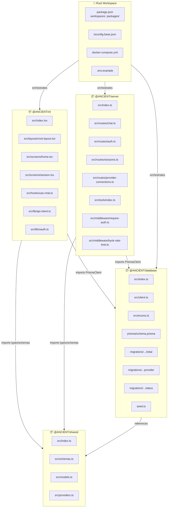
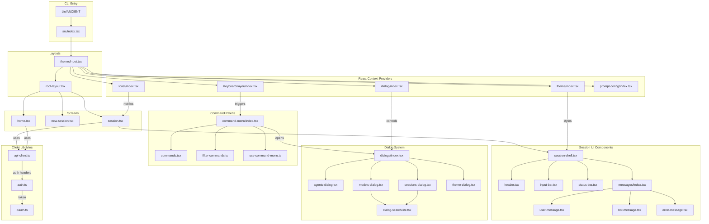
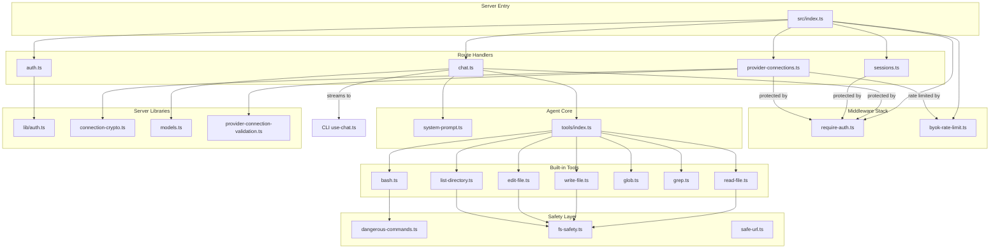
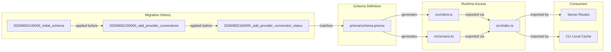
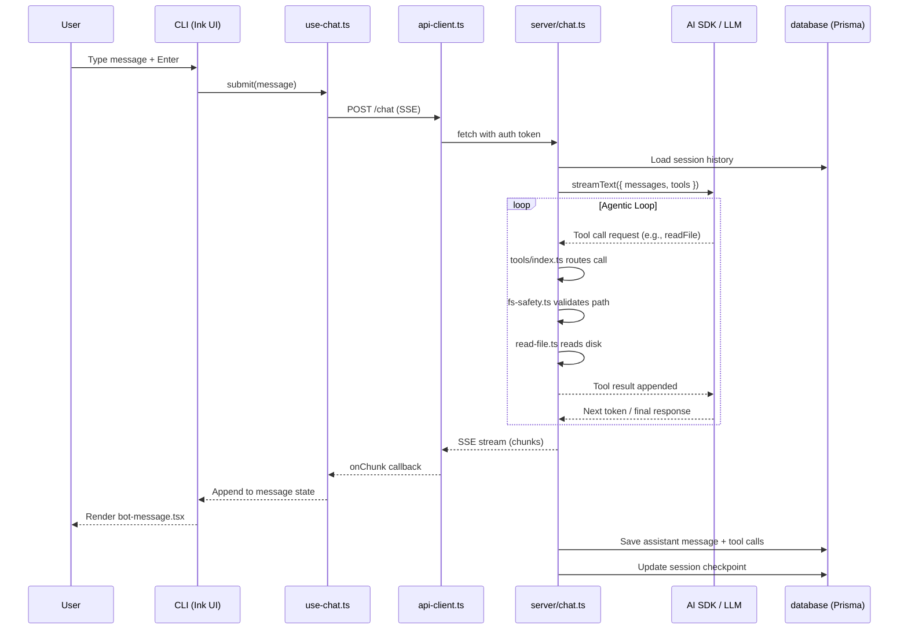
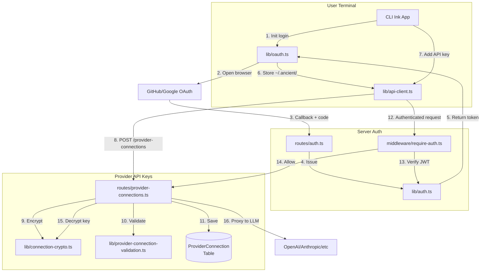

# 📘 ANCIENT — Software Documentation
**AI Coding Agent | Terminal UI | Bun/TypeScript/React Monorepo**

---

## 1. Executive Overview

**ANCIENT** is a self-hosted AI coding agent designed to replace per-seat subscription costs for AI coding assistants. It consists of a terminal-based UI (`packages/cli`), an API server (`packages/server`), a shared type/schema library (`packages/shared`), and a Prisma-based database layer (`packages/database`).

**Core Philosophy:** Instead of paying per seat for hosted AI tools, ANCIENT runs locally (or self-hosted) using free/open-weight models (e.g., `mistralai/devstral-2512:free` via OpenRouter) with an agentic loop, built-in tools, MCP support, subagents, and session persistence.

---

## 2. Repository Structure

```
ancient/
├── .env.example              # Environment variable template
├── .gitignore                # Root ignore rules
├── README.md                 # Project overview and architecture target
├── bun.lock                  # Bun lockfile (monorepo dependency graph)
├── docker-compose.yml        # Infrastructure orchestration (Postgres + App)
├── package.json              # Root workspace configuration
├── tsconfig.base.json        # Shared TypeScript compiler options
└── packages/
    ├── cli/                  # Terminal UI (Bun, TypeScript, React, Ink)
    ├── database/             # Prisma ORM, schema, migrations, seed
    ├── server/               # FastAPI-style HTTP API (Bun/Hono)
    └── shared/               # Cross-package types, Zod schemas, constants
```

---

## 3. Package-Level Documentation

### 3.1 `packages/cli` — Terminal UI Application

**Role:** The primary user interface. A terminal application built with React and Ink (React for terminals) that provides screens, layouts, dialogs, theming, and keyboard shortcuts.

**Key Technologies:** Bun, TypeScript, React, Ink, OpenTUI

**Entry Point:** `src/index.tsx` → renders the root layout and mounts the Ink app.

**Binary:** `bin/ANCIENT` — executable shell script that invokes the CLI.

#### File Inventory & Logic

| File | Type | Logic & Responsibility |
|------|------|------------------------|
| `package.json` | Config | Declares `@ANCIENT/cli` name, dependencies on `ink`, `react`, `zod`, `ai`, and internal workspace deps (`@ANCIENT/database`, `@ANCIENT/shared`). Defines build/dev scripts. |
| `tsconfig.json` | Config | Extends `tsconfig.base.json`, sets `jsx: react-jsx` for Ink components. |
| `bin/ANCIENT` | Shell | Executable entry script. Sets up the runtime environment and invokes `bun run src/index.tsx` (or compiled output). |
| `src/index.tsx` | Entry | Bootstraps the Ink renderer. Wraps the app in providers (Theme, Dialog, Toast, Keyboard-layer, Prompt-config) and mounts `<RootLayout />`. |
| `src/theme.ts` | Theme | Defines color tokens, spacing, and terminal-friendly theme variants (dark/light) used across all UI components. |
| `src/layouts/root-layout.tsx` | Layout | Top-level layout shell. Manages screen routing state (home, session, new-session) and renders the active screen. |
| `src/layouts/themed-root.tsx` | Layout | Wraps `RootLayout` with the theme provider context, ensuring all children inherit color/spacing tokens. |
| `src/screens/home.tsx` | Screen | Landing screen. Lists existing sessions, provides entry points to create new sessions or resume old ones. |
| `src/screens/new-session.tsx` | Screen | Configuration screen for starting a new agent session (model selection, agent type, initial prompt). |
| `src/screens/session.tsx` | Screen | The main chat interface. Renders message history, input bar, status bar, and handles real-time streaming from the server. |
| `src/components/header.tsx` | UI | Displays session title, current model, and connection status at the top of the terminal window. |
| `src/components/input-bar.tsx` | UI | User input component. Captures keystrokes, handles submit, and may trigger command-menu on special key sequences. |
| `src/components/status-bar.tsx` | UI | Bottom bar showing agent state (idle, thinking, tool-running), token usage, and keyboard shortcuts. |
| `src/components/spinner.tsx` | UI | Animated loading indicator for "agent is thinking" states. |
| `src/components/session-shell.tsx` | UI | Wrapper component for the session screen that manages layout geometry (header + messages + input + status). |
| `src/components/border.tsx` | UI | Decorative border component using Ink's `<Box>` with unicode border characters. |
| `src/components/dialog-search-list.tsx` | UI | Reusable searchable list widget used inside dialogs (e.g., filtering models or sessions). |
| `src/components/messages/index.tsx` | UI | Message list container. Maps over session messages and renders `<UserMessage>` or `<BotMessage>` accordingly. |
| `src/components/messages/user-message.tsx` | UI | Renders user prompts with right-alignment or distinctive styling. |
| `src/components/messages/bot-message.tsx` | UI | Renders agent responses, including markdown-like formatting, code blocks, and tool call annotations. |
| `src/components/messages/error-message.tsx` | UI | Displays error states (API failures, tool errors) with red styling. |
| `src/components/dialogs/index.tsx` | UI | Dialog host/container. Manages which dialog is currently open (agents, models, sessions, theme). |
| `src/components/dialogs/agents-dialog.tsx` | UI | Modal for selecting/configuring subagents (codebase investigator, code reviewer). |
| `src/components/dialogs/models-dialog.tsx` | UI | Modal for switching LLM providers/models. Fetches available models from the server. |
| `src/components/dialogs/sessions-dialog.tsx` | UI | Modal for browsing, searching, and loading saved sessions from the database. |
| `src/components/dialogs/theme-dialog.tsx` | UI | Modal for switching terminal color themes. |
| `src/components/command-menu/index.tsx` | UI | Command palette (⌘K-style) overlay. Provides quick access to actions without leaving the keyboard. |
| `src/components/command-menu/commands.tsx` | UI | Static command definitions (e.g., "New Session", "Switch Model", "Toggle Theme"). |
| `src/components/command-menu/types.ts` | Types | TypeScript interfaces for command objects (id, label, shortcut, action handler). |
| `src/components/command-menu/filter-commands.ts` | Logic | Fuzzy filtering logic for the command palette search input. |
| `src/components/command-menu/use-command-menu.ts` | Hook | Manages command menu state (open/close, selected index, filter text) and keyboard shortcuts. |
| `src/components/dev/render-guard.tsx` | Dev | Development-only component that catches render errors and prevents full crash loops during hot reload. |
| `src/hooks/use-chat.ts` | Hook | Core chat state management hook. Handles sending messages to the server SSE endpoint, accumulating streamed tokens, and updating local message history. |
| `src/lib/api-client.ts` | Lib | Typed HTTP client (likely wraps `fetch` with Zod validation) for calling `packages/server` REST endpoints. |
| `src/lib/auth.ts` | Lib | Client-side authentication helpers: token storage (in `~/.ancient/`), login state, logout. |
| `src/lib/oauth.ts` | Lib | OAuth flow initiator. Opens browser for provider auth and captures callback tokens. |
| `src/lib/http-errors.ts` | Lib | Error class definitions and retry logic for handling network failures or 4xx/5xx responses. |
| `src/lib/local-tools.ts` | Lib | Client-side tool definitions that map to server tool endpoints, used to render tool call UIs. |
| `src/providers/theme/index.tsx` | Provider | React Context provider for theme tokens. Provides `useTheme()` hook to descendants. |
| `src/providers/dialog/index.tsx` | Provider | Context provider for dialog stack state. Exposes `openDialog()`, `closeDialog()`, `activeDialog`. |
| `src/providers/dialog/types.ts` | Types | Dialog state TypeScript definitions. |
| `src/providers/toast/index.tsx` | Provider | Toast notification system for ephemeral success/error messages in the terminal. |
| `src/providers/toast/types.ts` | Types | Toast severity levels and timeout configurations. |
| `src/providers/prompt-config/index.tsx` | Provider | Holds the current session's prompt configuration (system prompt overrides, temperature, max tokens). |
| `src/providers/Keyboard-layer/index.tsx` | Provider | Global keyboard event listener. Maps key combinations (e.g., `Ctrl+K`, `Esc`) to command menu or dialog toggles. |

---

### 3.2 `packages/server` — API & Agent Runtime

**Role:** HTTP API server that handles authentication, chat streaming (SSE), session CRUD, provider connections, and tool execution. Serves as the bridge between the CLI UI and the LLM/agent logic.

**Key Technologies:** Bun, Hono (or similar lightweight HTTP framework), Zod, AI SDK (Vercel)

**Entry Point:** `src/index.ts` — starts the HTTP server and mounts route handlers.

#### File Inventory & Logic

| File | Type | Logic & Responsibility |
|------|------|------------------------|
| `package.json` | Config | Server dependencies: `hono`, `@ai-sdk/*`, `zod`, `prisma` (via `@ANCIENT/database`). |
| `tsconfig.json` | Config | Server-specific TS config, strict mode for API safety. |
| `src/index.ts` | Entry | Creates HTTP server, applies CORS/auth middleware, mounts `/auth`, `/chat`, `/sessions`, `/provider-connections` routers. Starts listening on `PORT` from env. |
| `src/system-prompt.ts` | Config | Default system prompt template injected into every agent conversation. Defines agent personality, tool usage rules, and safety reminders. |
| `src/routes/auth.ts` | Route | OAuth callback handler, token issuance (JWT), and session cookie management. |
| `src/routes/chat.ts` | Route | **Core agent route.** Accepts POST with messages, streams LLM response via SSE. Invokes the agentic loop: calls LLM → parses tool calls → executes tools → streams results back. |
| `src/routes/sessions.ts` | Route | CRUD for chat sessions: `GET /sessions`, `POST /sessions`, `GET /sessions/:id`, `DELETE /sessions/:id`. Persists via Prisma. |
| `src/routes/provider-connections.ts` | Route | Manages user API keys for LLM providers (OpenAI, Anthropic, OpenRouter). Encrypts keys at rest using `connection-crypto.ts`. |
| `src/middleware/require-auth.ts` | Middleware | Verifies JWT/session token on protected routes. Returns 401 if missing or invalid. |
| `src/middleware/byok-rate-limit.ts` | Middleware | Rate limiting for Bring-Your-Own-Key users to prevent abuse of the server as a proxy. |
| `src/lib/auth.ts` | Lib | Password hashing (bcrypt/argon2), JWT sign/verify, and user lookup utilities. |
| `src/lib/connection-crypto.ts` | Lib | AES-256-GCM encryption/decryption for storing user API keys in the database. Uses master key from env. |
| `src/lib/models.ts` | Lib | Model registry and metadata. Maps model IDs to context windows, pricing, and provider routing logic. |
| `src/lib/provider-connection-validation.ts` | Lib | Validates that a stored API key is still active (makes a cheap test request to the provider). |
| `src/lib/safe-url.ts` | Lib | URL validation helper to prevent SSRF attacks when the agent fetches web resources. |
| `src/lib/dangerous-commands.ts` | Lib | Blocklist/allowlist for shell commands. Flags `rm -rf /`, `mkfs`, `dd`, etc. Requires user approval before execution. |
| `src/lib/fs-safety.ts` | Lib | Filesystem guardrails. Restricts file operations to the project workspace, prevents escaping via `../` traversal. |
| `src/tools/index.ts` | Registry | Exports all built-in tools and registers them with the AI SDK `tool()` helper. Defines the tool schema array passed to the LLM. |
| `src/tools/read-file.ts` | Tool | Reads file contents from disk (with `fs-safety` checks). Returns text or base64 for images. |
| `src/tools/write-file.ts` | Tool | Writes or overwrites files. Requires explicit approval for existing files. |
| `src/tools/edit-file.ts` | Tool | Applies search-and-replace or diff-based edits to existing files. |
| `src/tools/list-directory.ts` | Tool | Returns directory contents (files + subdirs) with metadata. |
| `src/tools/glob.ts` | Tool | Pattern-based file search (e.g., `**/*.ts`). |
| `src/tools/grep.ts` | Tool | Searches file contents for regex/pattern matches across the codebase. |
| `src/tools/bash.ts` | Tool | Executes shell commands in a sandboxed subprocess. Integrates with `dangerous-commands.ts` for safety approval. |

---

### 3.3 `packages/database` — Data Persistence Layer

**Role:** Prisma ORM setup, database schema, migrations, and seed data. Shared across CLI (for local caching) and Server (for primary persistence).

**Key Technologies:** Prisma, PostgreSQL, TypeScript

#### File Inventory & Logic

| File | Type | Logic & Responsibility |
|------|------|------------------------|
| `package.json` | Config | Prisma client generation scripts. Exports `@ANCIENT/database`. |
| `tsconfig.json` | Config | Database package TS configuration. |
| `prisma.config.ts` | Config | Prisma Client configuration (connection pooling, logging, binary targets). |
| `prisma/schema.prisma` | Schema | **Source of truth** for data models: `User`, `Session`, `Message`, `ProviderConnection`, `AgentConfig`, `ToolCall`, `Checkpoint`. Defines relations and indexes. |
| `prisma/migrations/20260802140000_initial_schema/migration.sql` | Migration | Initial table creation: users, sessions, messages. |
| `prisma/migrations/20260802150000_add_provider_connections/migration.sql` | Migration | Adds `ProviderConnection` table for storing encrypted API keys. |
| `prisma/migrations/20260802160000_add_provider_connection_status/migration.sql` | Migration | Adds status/validation fields to provider connections (active, invalid, rate-limited). |
| `seed.ts` | Seed | Populates default data on fresh installs (default admin user, example sessions, built-in model list). |
| `src/client.ts` | Lib | Singleton PrismaClient instance with `$extends` for custom query logging or soft-delete logic. |
| `src/enums.ts` | Lib | TypeScript enum mirrors for Prisma enums (e.g., `MessageRole`, `ProviderType`, `AgentStatus`). |
| `src/index.ts` | Barrel | Re-exports `prisma` client and enums for consumers (`@ANCIENT/database`). |

---

### 3.4 `packages/shared` — Cross-Cutting Types & Schemas

**Role:** Prevents circular dependencies between `cli` and `server` by housing shared Zod schemas, TypeScript types, and provider constants.

**Key Technologies:** TypeScript, Zod

#### File Inventory & Logic

| File | Type | Logic & Responsibility |
|------|------|------------------------|
| `package.json` | Config | Zero-runtime-dependencies package. Used by both CLI and Server. |
| `tsconfig.json` | Config | Strictest TS settings (no emit, type-check only). |
| `src/index.ts` | Barrel | Re-exports all shared modules. |
| `src/schemas.ts` | Schema | Zod schemas for: `ChatMessage`, `SessionConfig`, `ToolCallPayload`, `ProviderCredential`, `UserPreferences`. Used for runtime validation on both client and server. |
| `src/models.ts` | Types | TypeScript interfaces derived from Zod schemas via `z.infer<typeof Schema>`. Includes `ModelInfo`, `AgentType`, `ThemeName`. |
| `src/providers.ts` | Constants | Registry of supported LLM providers (`openai`, `anthropic`, `openrouter`, `google`, `local`). Maps to endpoint URLs and default models. |

---

## 4. Connection & Dependency Graphs (Mermaid)

### 4.1 Monorepo Workspace Dependency Graph



---

### 4.2 CLI Internal Component & Provider Network



---

### 4.3 Server API & Agent Runtime Network



---

### 4.4 Database Schema & Migration Flow



---

### 4.5 Data Flow — Chat Session Lifecycle



---

### 4.6 Authentication & Provider Connection Flow



---

## 5. Reference Lines for Software Documentation

This documentation follows these software documentation standards:

1. **IEEE 830 (Software Requirements Specifications)** — Functional decomposition by package and component.
2. **ISO/IEC/IEEE 42010 (Architecture Description)** — Multiple architectural viewpoints (logical, process, development).
3. **C4 Model (Simon Brown)** — Level 2 (Container) and Level 3 (Component) diagrams rendered in Mermaid.
4. **Diátaxis Framework** — Separation into reference (file inventory), explanation (logic), and how-to (flow diagrams).

---

## 6. Key Architectural Decisions

| Decision | Rationale |
|----------|-----------|
| **Monorepo with Bun workspaces** | Single command to run CLI + Server + DB. Shared code in `packages/shared` prevents duplication. |
| **Prisma in separate package** | Both CLI and Server can query the database without circular dependencies. |
| **React/Ink for Terminal UI** | Familiar component model, declarative rendering, and existing ecosystem (OpenTUI). |
| **SSE for chat streaming** | Server-Sent Events provide low-latency token streaming without WebSocket complexity. |
| **Encrypted provider keys** | `connection-crypto.ts` ensures user API keys are never stored plaintext, even in self-hosted scenarios. |
| **Tool safety at server level** | `dangerous-commands.ts` and `fs-safety.ts` run on the server to prevent malicious prompt injection from bypassing client-side checks. |

---

## 7. Environment & Deployment

**Local Development:**
```bash
bun install          # Installs all workspace packages
bun run dev:server   # Hot-reloads server
bun run dev:cli      # Hot-reloads CLI
```

**Docker (from `docker-compose.yml`):**
- PostgreSQL container for persistence
- Server container exposing HTTP API
- CLI runs natively or inside a container with TTY access

**Required Environment Variables** (from `.env.example`):
- `DATABASE_URL` — PostgreSQL connection string
- `JWT_SECRET` — Signing key for auth tokens
- `ENCRYPTION_KEY` — Master key for `connection-crypto.ts`
- `OPENROUTER_API_KEY` — Default provider key (optional if using BYOK)

---

## 8. Status & Migration Notes

As noted in the README, this is a **rebuild of HaMan** with the terminal UI already live and the agent core being merged in. The architecture target shows a planned `packages/agent` directory that does not yet exist in the current tree. The current agent loop lives inside `packages/server/src/routes/chat.ts` and `packages/server/src/tools/` as an interim consolidation step.
