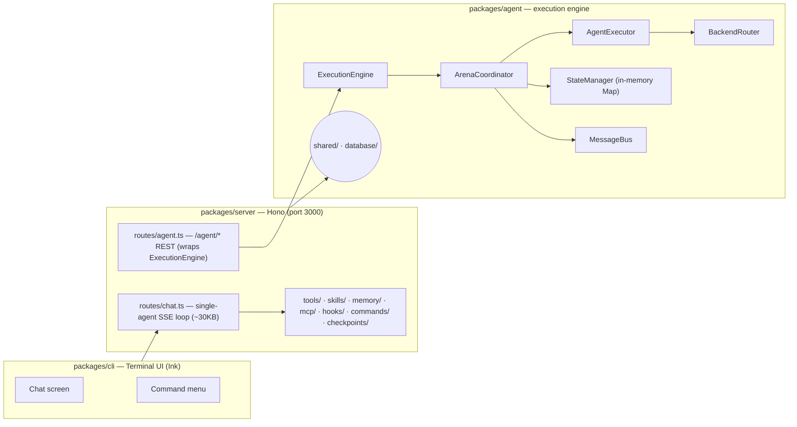
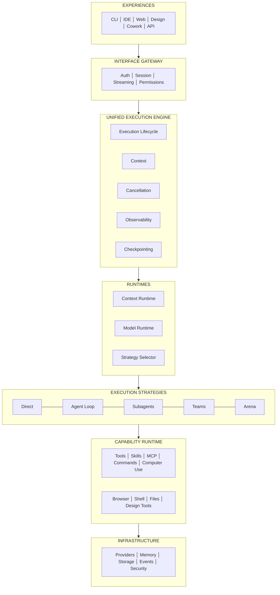

# Architecture — as-built audit & target

**Status:** living document · **Last updated:** 2026-08-29 · **Branch:** `agent`

This document reverse-engineers ANCIENT's **actual** architecture from the current source,
captures the assumptions embedded in it, and records the **target** architecture we commit to
moving toward. It exists to make the gap between *documented intent* and *running reality*
explicit, so future work is grounded instead of aspirational.

> The sibling file [`docs/architecture/ASSUMPTIONS.md`](architecture/ASSUMPTIONS.md) is the
> live assumption register. This file is the narrative; that file is the ledger.

---

## 1. Why this document exists

The repo's README and `docs/*.md` describe a rich multi-agent system. The source code is,
commendably, honest about what actually runs (several modules carry `// NOTE:` comments
recording "this did not exist before"). **Architecture Review V2** is the discipline of closing
the gap between the two:

```text
Current Code
    ↓
Reverse-engineer actual architecture
    ↓
Find assumptions
    ↓
Attack assumptions
    ↓
Identify gaps
    ↓
Define target invariants
    ↓
Fix one architectural boundary at a time
    ↓
Only then resume expansion
```

---

## 2. As-built architecture (what the code actually does today)

All findings below are derived from the source, not from the README. File paths and line
references are given where they matter.



### 2.1 The `ExecutionEngine` chain

`packages/server/src/routes/agent.ts` creates **one in-process engine** and is the only server
consumer of `@ANCIENT/agent`:

`packages/agent/src/runtime/engine.ts` — its constructor (lines 28–33) **builds and owns** all
four runtime collaborators:

```text
ExecutionEngine
      ↓ (constructor)
MessageBus + BackendRouter + AgentExecutor + ArenaCoordinator
```

This construction pattern is the source of **Assumption 1** (below): today,

> Execution = multi-agent coordination.

Because the engine's default (and only wired) path is `execute(team, task)` →
`ArenaCoordinator` → protocol dispatch → `AgentExecutor` → `BackendRouter`.

### 2.2 State & checkpointing are in-memory only

`packages/agent/src/runtime/state.ts` implements `StateManager` with two plain `Map`s
(`states`, `checkpoints`, lines 11–12). There is **no** DB, disk, or Redis backing.

`routes/agent.ts` documents this precisely (lines 10–17):

> Execution state lives in one in-memory ExecutionEngine for the whole process. It does not
> survive a server restart and will not work correctly behind more than one server instance
> sharing a load balancer … needs a shared store (Redis, or the DB) before this scales beyond
> one process.

Consequence (**Assumption 3**):

```text
Server restarts  →  Execution disappears
```

### 2.3 The server is thick; two execution worlds do not share code

`routes/chat.ts` is **30,928 bytes / ~712 lines** — the *classic single-agent SSE loop*
(`ai.streamText`, `createToolsAsync`, model-router, hooks, skills, memory, checkpoints). The
`/agent` path is a separate execution world with its own engine. They share **no execution
code**:

- Tools/skills/hooks/memory/MCP live on the **server** request path (`chat.ts`).
- `BackendRouter` (`packages/agent/src/backends/router.ts`) explicitly does **not** execute
  tools — its header says real tools live in `packages/server/src/tools/*` and wiring them
  "is a decision for you to make, not something to fake here."

**Assumption 4** follows: the server is accumulating every AI behavior into route handlers.

### 2.4 What is wired vs. un-wired (the honesty map)

| Subsystem | Status in code | Evidence |
|-----------|----------------|----------|
| `ExecutionEngine` → `ArenaCoordinator` | Wired (sole path) | `engine.ts:31-32` |
| `ExecutionScheduler` (cross-team concurrency) | **Not wired**, no-op | `engine.ts:14-21` |
| `BackendRouter` tool execution | **Not wired** | `backends/router.ts` header |
| `StateManager` persistence | **Not** durable (in-memory) | `state.ts:11-12`, `agent.ts:10-24` |
| `routing.routingRules` | Contract only, nothing populates it | `backends/router.ts` |
| Server `chat.ts` tools/skills/memory/MCP | Wired | `routes/chat.ts` imports |

---

## 3. The four assumptions under attack

Each assumption is spelled out with evidence, failure mode, blast radius, alternatives, and a
decision. These are also recorded (and tracked) in the register file.

### Assumption 1 — *The agent system is the engine*

- **Implicit claim:** `ExecutionEngine` constructs `ArenaCoordinator` + `AgentExecutor` +
  `BackendRouter` + `MessageBus`, encoding *execution = multi-agent coordination*.
- **Why it's too narrow:** a coding task may need only a single agent; a design task may need an
  agent + image/design tools; an office workflow may need agent + browser + files; only some
  tasks need multiple agents.
- **Decision:** **Change.** Execution must be more fundamental than agents; the arena becomes one
  *strategy* among several.

### Assumption 2 — *Multi-agent architecture automatically means more power*

- **Challenge:** why? **Evidence:** none yet — more agents add cost, latency, context, failure
  points, coordination errors, and duplicate work.
- **Decision:** **Change.** Introduce **complexity-must-be-earned** via a strategy selector
  (see §5), selected by the engine, not the UI.

### Assumption 3 — *State management exists because `StateManager` exists*

- **Reality:** it's an in-memory `Map` store with no durability.
- **Decision:** **Change.** New model: *hot runtime state → checkpoint policy → durable execution
  store*, with a durable lifecycle event stream (created / started / plan-updated / tool-executed
  / artifact-created / checkpoint-saved / paused / resumed / completed / failed).

### Assumption 4 — *The server can contain all AI capabilities*

- **Reality:** `chat.ts` is ~30KB and the server hosts agents, checkpoints, commands, hooks, mcp,
  memory, skills, tools.
- **Decision:** **Change.** The server should trend toward a thin **interface gateway**
  (API, auth, session boundary, streaming, transport), with AI behavior pushed into a capability
  runtime.

---

## 4. Target architecture (the structure we are building)



Key principle: **execution strategies are a leaf**, not the trunk. The Arena is one strategy
(`Arena`), used only when justified.

---

## 5. Complexity must be earned (strategy ladder)

```mermaid
flowchart LR
    A["Simple task"] --> B["Direct execution"]
    B --> C["Moderate task"] --> D["Single agent loop"]
    D --> E["Complex task"] --> F["Planning + subagents"]
    F --> G["Large independent tasks"] --> H["Parallel execution"]
    H --> I["Only justified cases"] --> J["Arena / Team"]
```



The **strategy selector** chooses the cheapest reliable architecture for the task. It is an
engine decision, not a UI decision.

---

## 6. Migration: Architecture Review V2 — phases

We do **not** rewrite everything at once (that would reproduce the classic
stop-delete-rebuild-bug cycle). Instead:

1. **Phase 1 — Freeze expansion.** No new major features; each new layer must first be
   grounded in the current dependency structure.
2. **Phase 2 — Assumption register.** Every subsystem gets an entry in
   [`architecture/ASSUMPTIONS.md`](architecture/ASSUMPTIONS.md): *assumption, evidence, failure
   mode, blast radius, alternatives, decision, test*.
3. **Audit order** (each is one boundary, fixed then verified):
   1. Core product boundaries *(what is ANCIENT?)*
   2. **Execution model** (the most fundamental)
   3. Context architecture
   4. Agent model
   5. Tool / capability architecture
   6. Provider / model architecture (BYOK, fallback, routing, cost)
   7. State & persistence
   8. Security
   9. Product experiences
4. Resume expansion only after the correct invariants are in place.

The first audit target is the **Execution model** (see the `ExecutionEngine` entries in the
register file).

---

## 7. References

- [`docs/architecture/ASSUMPTIONS.md`](architecture/ASSUMPTIONS.md) — live assumption register.
- [`AGENTS.md`](../AGENTS.md) — repo conventions (commits, docs, this process).
- `packages/agent/src/runtime/engine.ts` — the current `ExecutionEngine`.
- `packages/agent/src/runtime/state.ts` — the current in-memory `StateManager`.
- `packages/server/src/routes/agent.ts` — the documented in-process limitation.
- `packages/server/src/routes/chat.ts` — the thick single-agent path (~30KB).
- `README.md` — the documented intent (vs. as-built gap, see §2.4).
