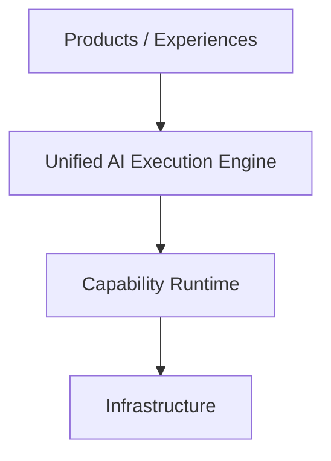
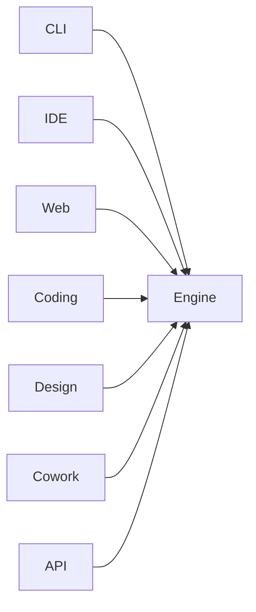
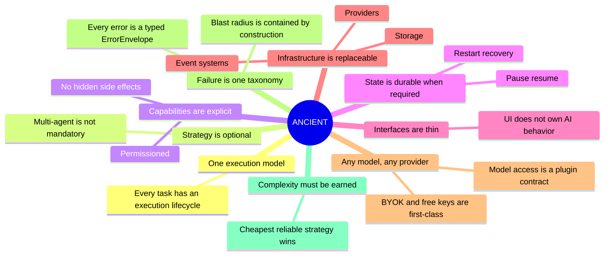
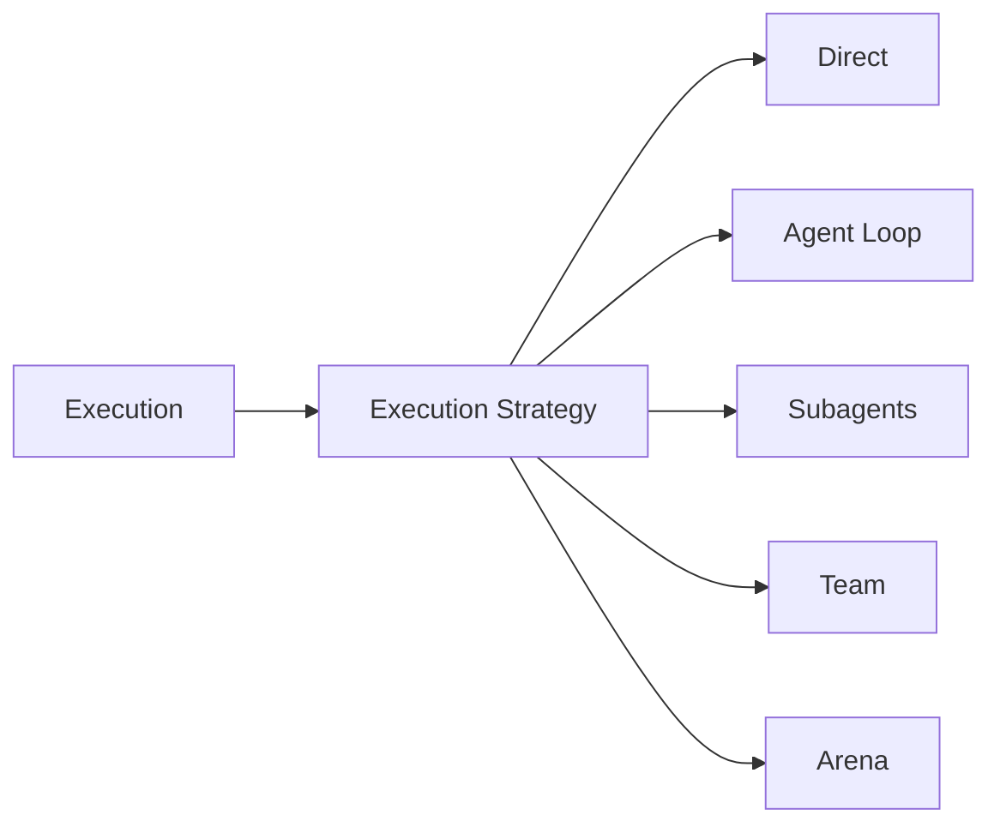
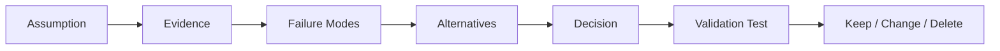
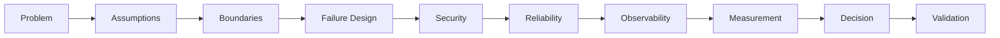

# ANCIENT Architecture V2

> **Status:** Architecture Review / Target Design\
> **Purpose:** Define the engineering boundaries of ANCIENT before major
> feature expansion.
>
> **v2.1 note:** This revision adds a universal Model & Provider Harness,
> a single canonical Error and Failure Model that every other layer now
> defers to, and a concrete Implementation Guide. See Section 6 below.

## 1. Core thesis

ANCIENT is **not** one giant coding agent and it is not a collection of
unrelated AI features.

It is:



The same engine must support multiple experiences without forcing every
experience through the same workflow.



## 2. Architecture layers

1.  [Experiences](./01-experiences/README.md)
2.  [Interface Gateway](./02-interface-gateway/README.md)
3.  [Unified Execution Engine](./03-execution-engine/README.md)
4.  [Execution Strategies](./04-execution-strategies/README.md)
5.  [Capability Runtime](./05-capability-runtime/README.md)
6.  [Infrastructure](./06-infrastructure/README.md)
7.  [Cross-Cutting Concerns](./07-cross-cutting-concerns/README.md)
8.  [Architecture Assumption Register](./08-assumption-register/README.md)
9.  [Migration Plan](./09-migration/README.md)

## 3. Non-negotiable invariants

These are the rules future features must not casually violate:



## 4. The critical architectural distinction

### Execution is not an agent



An agent is one possible strategy used inside an execution.

## 5. Review rule

For every new subsystem:



Do not add architecture because it sounds powerful. Add it because the
simpler alternative has been shown to be insufficient.

---

## Engineering Deep-Dive Additions

Architecture V3 adds the following engineering references:

11. [Architecture Philosophy](./00-architecture-philosophy/README.md)
12. [System Design Principles](./11-system-design-principles/README.md)
13. [Reliability and Resilience](./12-reliability-and-resilience/README.md)
14. [Security and Trust](./13-security-and-trust/README.md)
15. [Data and State Design](./14-data-and-state-design/README.md)
16. [Performance and Cost](./15-performance-and-cost/README.md)
17. [Testing and Validation](./16-testing-and-validation/README.md)
18. [Package Boundaries](./17-package-boundaries/README.md)
19. [Engineering Review Checklist](./18-engineering-review-checklist/README.md)
20. [Architecture Decisions (ADR index)](./10-architecture-decisions/README.md)

## 6. v2.1 additions --- Universal Model Access + Unified Failure Design

These three documents are new in this revision and are the direct
answer to two requirements: *"any model, any provider, even free
keys, without breaking"* and *"redesign the error and failure points
with a detailed implementation guide."*

21. [**Model & Provider Harness**](./19-model-provider-harness/README.md) ---
    every model provider (Anthropic, OpenAI, DeepSeek, local/self-hosted,
    or a user's own free API key) is a swappable plugin behind one
    contract; sessions survive a provider swap mid-conversation; a
    provider outage degrades gracefully instead of breaking the run.
22. [**Error and Failure Model**](./20-error-and-failure-model/README.md) ---
    the single closed `ErrorCode` taxonomy and `ErrorEnvelope` shape
    that every other layer (Gateway, Engine, Strategies, Capabilities,
    Infrastructure, Providers) now defers to instead of inventing its
    own error handling.
23. [**Implementation Guide**](./21-implementation-guide/README.md) ---
    concrete tech stack, repository layout, database schema, drop-in
    contract/retry/circuit-breaker code, local dev setup, and a
    week-by-week build sequence with a "definition of done" that
    requires failure-path evidence, not just a working happy path.

## Architecture V3 engineering doctrine



The rule is simple:

> A component is not accepted because it works in the happy path. It is
> accepted only when its ownership, failure behavior, security
> boundary, operational cost, and validation strategy are understood
> --- and, as of v2.1, only when its failure behavior is expressed as a
> typed `ErrorEnvelope` (Layer 20) with a tested recovery path
> (Layer 16.4), not an untyped exception discovered in production.

## Full document index

``` text
00-architecture-philosophy/
01-experiences/
02-interface-gateway/
03-execution-engine/
04-execution-strategies/
05-capability-runtime/
06-infrastructure/
07-cross-cutting-concerns/
08-assumption-register/
09-migration/
10-architecture-decisions/
11-system-design-principles/
12-reliability-and-resilience/
13-security-and-trust/
14-data-and-state-design/
15-performance-and-cost/
16-testing-and-validation/
17-package-boundaries/
18-engineering-review-checklist/
19-model-provider-harness/     <- NEW (v2.1)
20-error-and-failure-model/    <- NEW (v2.1)
21-implementation-guide/       <- NEW (v2.1)
```
