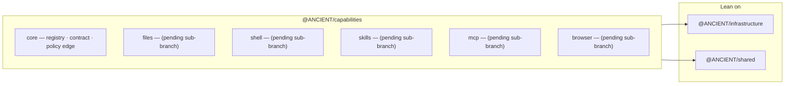

# Capability runtime layer — as-built

**Branch:** `layer/06-capabilities` · **Status:** in progress (sub-01 core wired) ·
**Register:** [A-CAP-001](ASSUMPTIONS.md), [A-LAYER-001](ASSUMPTIONS.md), [A-LAYER-002](ASSUMPTIONS.md)

The **Capability Runtime** (ARCHITECTURE.md §4, audit item #5): owns tools, skills, MCP,
browser, and file/shell behaviors so the engine and gateway never grow a monolithic tool
stack (A-EXEC-004). Depends only on `@ANCIENT/shared` + `@ANCIENT/infrastructure`
(A-LAYER-002); never imports upward.

Sub-layers are added one per sub-branch under `sub/06/*`, then merged here. `core`
(commit `a24c3a1`) is wired so far; `files`, `shell`, `skills`, `mcp`, `browser` are next
in build order. `commands`, `computer-use`, `design` stay a README roadmap until the engine
exists (per A-EXEC-004 test).

---

## Sub-01 — Core (done)

The registry + the **central policy edge** every tool runs through (A-CAP-001).

| File | Owning responsibility |
|------|------------------------|
| `src/core/types.ts` | `ToolDefinition` (name, description, zod `inputSchema`, `RiskCategory`, `modes`, `maxResultChars`, `target`, `execute`), `ExecutionScope`, `ConsentProvider`, `ExecutionResult`, `DEFAULT_MAX_RESULT_CHARS`, `capResultLength`, `serializeResult`. |
| `src/core/registry.ts` | `CapabilityRegistry` — register/registerAll/get/has/list/listFor. Mode-gating default: no explicit `modes` ⇒ visible in BUILD always, PLAN only for `read`-category (mirrors the server's `READ_ONLY_BASE_TOOLS` split); explicit `modes` win. Allow-list by name. |
| `src/core/execute.ts` | `executeTool()` — the edge every tool inherits: parse → `ApprovalPolicy.evaluate` (deny / require-consent via `ConsentProvider`; no provider ⇒ deny) → execute → serialize → `Redactor` (infra security) → size budget. Never throws; executor errors become `ok:false`. |
| `src/core/adapters.ts` | `toToolSet()` — mode-gated, allow-listed registry slice → AI-SDK `ToolSet`; every SDK call runs the same central edge; denial throws so the model can recover. |
| `src/core/core.test.ts` | 17 tests (registry, mode gating, allow-list, policy, consent, budget, redaction, error mapping, adapter). |

**Design decisions:**
- **One registry, no per-module policy** — files/shell/skills/mcp/browser contribute
  definitions; approval, consent, budgeting, redaction apply centrally (A-CAP-001 TEST:
  a new module registers with zero chat-handler changes and inherits the policies).
- **Framework-adjacent** — `ToolDefinition` is a plain object; the SDK is an adapter, not
  the contract (MCP tools, which are not AI-SDK native, fit the same shape).
- **Safe PLAN default** — non-read tools are excluded from PLAN mode unless a module opts in,
  preserving the shipped read-only plan behavior.

## Verification

- `npm run typecheck` — exit 0 (all 7 packages incl. `capabilities`).
- Full suite — **121 pass** (104 + 17 core) as of `sub/06/01-core`, 0 fail.