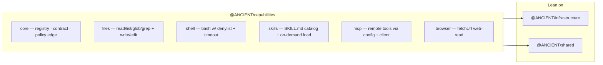

# Capability runtime layer — as-built

**Branch:** `layer/06-capabilities` · **Status:** done (all six subs wired) ·
**Register:** [A-CAP-001](ASSUMPTIONS.md), [A-LAYER-001](ASSUMPTIONS.md), [A-LAYER-002](ASSUMPTIONS.md)

The **Capability Runtime** (ARCHITECTURE.md §4, audit item #5): owns tools, skills, MCP,
browser, and file/shell behaviors so the engine and gateway never grow a monolithic tool
stack (A-EXEC-004). Depends only on `@ANCIENT/shared` + `@ANCIENT/infrastructure`
(A-LAYER-002); never imports upward.

Sub-layers were added one per sub-branch under `sub/06/*`, then merged here. All six are
wired: `core` (`a24c3a1`), `files` (`509e26f`), `shell` (`da57e75`), `skills` (`99a02cc`),
`mcp` (`c8aa691`), `browser` (`b3b3d1c`). `commands`, `computer-use`, `design` stay a
README roadmap until the engine exists (per A-EXEC-004 test).

---

## Sub-01 — Core (done)

The registry + the **central policy edge** every tool runs through (A-CAP-001).

| File | Owning responsibility |
|------|------------------------|
| `src/core/types.ts` | `ToolDefinition` (name, description, zod `inputSchema`, `RiskCategory`, `modes`, `maxResultChars`, `target`, `execute`), `ExecutionScope`, `ConsentProvider`, `ExecutionResult`, `DEFAULT_MAX_RESULT_CHARS`, `capResultLength`, `serializeResult`. |
| `src/core/registry.ts` | `CapabilityRegistry` — register/registerAll/get/has/list/listFor. Mode-gating default: no explicit `modes` ⇒ visible in BUILD always, PLAN only for `read`-category (mirrors the server's `READ_ONLY_BASE_TOOLS` split); explicit `modes` win. Allow-list by name. |
| `src/core/execute.ts` | `executeTool()` — the edge every tool inherits: parse → `ApprovalPolicy.evaluate` (deny / require-consent via `ConsentProvider`; no provider ⇒ deny) → execute → serialize → `Redactor` (infra security) → size budget. Never throws; executor errors become `ok:false`. |
| `src/core/adapters.ts` | `toToolSet()` — mode-gated, allow-listed registry slice → AI-SDK `ToolSet`; every SDK call runs the same central edge; denial throws so the model can recover. |
| `src/core/core.test.ts` | 17 tests (registry, mode gating, allow-list, policy, consent, budget, redaction, error mapping, adapter). |

**Design decisions:**
- **One registry, no per-module policy** — files/shell/skills/mcp/browser contribute
  definitions; approval, consent, budgeting, redaction apply centrally (A-CAP-001 TEST:
  a new module registers with zero chat-handler changes and inherits the policies).
- **Framework-adjacent** — `ToolDefinition` is a plain object; the SDK is an adapter, not
  the contract (MCP tools, which are not AI-SDK native, fit the same shape).
- **Safe PLAN default** — non-read tools are excluded from PLAN mode unless a module opts in,
  preserving the shipped read-only plan behavior.

## Sub-02 — Files (done)

Six contributing tools, hierarchy-safe and PLAN-gated, on the same central edge.

| File | Owning responsibility |
|------|------------------------|
| `src/files/path-safety.ts` | `resolveWithinCwd(cwd, path)` — ported from `packages/server` (MIT attribution); returns `null` on escape (incl. prefix masquerade like `cwd-evil`). The containment floor for every file tool. |
| `src/files/glob.ts` | `globToRegExp`/`globMatches` — `**` crosses `/`, single `*` does not; `walkFiles(dir)` async recursive `fs/promises` walk returning `/`-joined relative paths. |
| `src/files/tools.ts` | Six `ToolDefinition`s: `readFile`/`listDirectory`/`glob`/`grep` (read) + `writeFile`/`editFile` (write). Schemas from `@ANCIENT/shared` `toolInputSchemas`. `target()` exposes the path for approval display. `grep` truncates at 100 matches (`truncated` flag), honors an `include` filename glob. `editFile` requires a unique `oldString` (0 → not found, >1 → reject). |
| `src/files/index.ts` | Files-capability barrel; re-exported from package root. |
| `src/files/files.test.ts` | 14 tests over real `mkdtemp` trees: containment rejection (`../../x`, prefix masquerade), read/list/glob/grep + include filtering, parent-dir creation, unique-edit enforcement, registry wiring, PLAN exclusion of write tools. |

**Design decisions:**
- **Containment is a runtime property, not a policy** — `ApprovalPolicy` decides *who* may
  write; `resolveWithinCwd` decides *what path* is ever reachable. Both apply to every
  invocation inside the central edge.
- **Write tools ship excluded from PLAN** by the registry's safe default (category-driven):
  BUILD may write, PLAN may only read.
- **Good CLI UX on denial** — the write-tool tests run under `ApprovalPolicy().allow("write")`;
  under the default policy they are denied before touching the filesystem (asserted by the
  core approval tests).

## Sub-03 — Shell (done)

One contributing tool (`bash`, category `exec`), approval-gated with a denylist floor.

| File | Owning responsibility |
|------|------------------------|
| `src/shell/dangerous-commands.ts` | `findDangerousCommandMatch` — denylist ported from `packages/server` (MIT attribution): `rm -rf` over root/home/parent, `git push --force main/master`, `git reset --hard`, `curl`/`wget` piped to a shell, `mkfs`, `dd` to block devices, fork bomb, `chmod -R 777 /`, `sudo rm`. |
| `src/shell/tools.ts` | `bashTool` — `bash`/`exec`, denylist check **before** spawn, `spawn(shell:true, cwd=scope.cwd)`, per-stream 20k cap with truncation marker, timeout kill (default 30s from the shared `bash` schema), `timedOut` flag, error mapping that never throws. |
| `src/shell/shell.test.ts` | 10 tests — denylist positives/negatives, deny-before-spawn, cwd execution, non-zero exit, timeout kill, exec default denial, BUILD/PLAN gating, truncation of a 50k-output command. |

**Design decisions:**
- **Approval is the gate, the denylist is the floor** — the default policy denies `exec`
  outright; a policy that allows `exec` still hits the denylist inside the tool. Two
  independent layers of defense for an operation that can reach anywhere a user can.
- **Cross-platform by default** — `shell:true` (cmd/sh) rather than a hard-coded `bash`
  binary, so the same `@ANCIENT/capabilities` package behaves identically on Windows and
  POSIX hosts. Timeout is enforced by killing the shell process; best-effort portability.

## Sub-04 — Skills (done)

Two read-category tools — progressive disclosure for SKILL.md instruction packages.

| File | Owning responsibility |
|------|------------------------|
| `src/skills/frontmatter.ts` | `parseFrontmatter`/`parseList` — minimal YAML-frontmatter parser ported from `packages/server` (MIT attribution); flat `key: value` + comma lists, no YAML dependency. |
| `src/skills/loader.ts` | `skillRoots(cwd)` (global `~/.ancient/skills` + project `<cwd>/.ancient/skills`, `ANCIENT_USER_DIR` override), `listSkills` (project shadows global; malformed skills skipped), `loadSkill` (20k body cap + resource listing), `buildSkillsPromptBlock` (token-lean system-prompt index). |
| `src/skills/tools.ts` | `listSkillsTool` (catalog: name/source/description) + `useSkillTool` (full body + bundled resources + note) — both `read`/PLAN-safe. |
| `src/skills/skills.test.ts` | 11 hermetic tests (ANCIENT_USER_DIR temp fixture): root shadowing, frontmatter parsing, body load, unknown-name error, arg validation, edge + registry wiring, PLAN gating. |

**Design decisions:**
- **Progressive disclosure, cost near zero** — only `listSkills`'s name+description ever
  enters a prompt; the full body loads only through `useSkill`, capped at 20k per skill.
- **Self-contained, no server imports (A-LAYER-002)** — the parser and root discovery are
  ported into the package; the capability layer never imports upward.
- **Portable global root** — `ANCIENT_USER_DIR` lets deployments relocate `~/.ancient`
  without code changes and makes tests hermetic (never touches the real home).

## Sub-05 — MCP (done)

Discovery + client + remote tools folded into the registry (A-CAP-001) via a
peer-level SDK dependency (A-LAYER-002 — never an upward import).

| File | Owning responsibility |
|------|------------------------|
| `src/mcp/config.ts` | `mcpConfigPaths`/`loadMcpConfig` — merged `{ mcpServers }` from `~/.ancient/.mcp.json` (global) + `<cwd>/.mcp.json` (project wins), `ANCIENT_USER_DIR` override, malformed files skipped. |
| `src/mcp/json-schema.ts` | `jsonSchemaToZod` — JSON Schema → zod for remote `inputSchema` (object/required/optional/array/string-enum/string/number/int/bool); unknown shapes degrade to `z.unknown()`. |
| `src/mcp/client.ts` | `getServers` (lazy per-cwd cache, 5-min TTL), stdio + HTTP transports via `@modelcontextprotocol/sdk` (dynamic import), per-server statuses, remote call (isError mapping + 10k result cap), `resetMcpCache`/`disposeMcpConnections`. |
| `src/mcp/tools.ts` | `listMcpServersTool` (read/PLAN-safe) + `mcpToolDefinitions(cwd)` factory: every remote tool as `mcp__<server>__<tool>`, category `exec`, `target` = tool name for approval display. |
| `src/mcp/fixtures/mock-server.ts` | A real SDK `McpServer` exposing one tool, spawned in tests as a stdio child (`process.execPath`). |
| `src/mcp/mcp.test.ts` | 11 tests — config merge/shadow, malformed-config skip, schema translation + enum validation, and a true e2e: connect → status → schema → central-edge call (exec allow) → default-policy denial. |

**Design decisions:**
- **Remote tools are exec until a policy says otherwise** — the default `ApprovalPolicy`
  denies `exec`, so every `mcp__*` tool is inert until an operator allows the category
  (and, via the same central edge, consent/redaction/budget still apply). Granular
  per-tool approval rules are future work (the rule table already has `targetPattern`).
- **JSON Schema → zod at the boundary** — the registry contract is zod (A-CAP-001); MCP
  declares JSON Schema, so translation happens in the mcp module, not in core.
- **Dynamic registration is the honest exception** — MCP tools exist only after a live
  connection, so they're pulled at startup and `registerAll`'d, vs. the static modules.

## Sub-06 — Browser (done)

Web-read tooling — the honest "browser" for a terminal-first agent, no automation dep.

| File | Owning responsibility |
|------|------------------------|
| `src/browser/fetch.ts` | `fetchUrl` — global fetch + AbortController timeout, redirects, 2 MB raw-byte guard, structured errors (never throws), `maxChars`; `htmlToText` — naive script/style/comment/tag strip, entity decode, whitespace collapse (zero deps). |
| `src/browser/tools.ts` | `fetchUrlTool` — category `network` (denied by default), `target` = URL for approval display. |
| `src/browser/browser.test.ts` | 12 tests over a local `node:http` server — htmlToText, plain-text fetch, HTML extraction, non-http rejection, timeout on a slow route, 404 surfacing, maxChars, network default-deny, network-allowed run, arg validation, registry gating, approval target. |

**Design decisions:**
- **Network egress is opt-in** — `fetchUrl` is category `network`, denied by the default
  `ApprovalPolicy`; reads of the open web require an operator to allow the category, then
  it inherits consent/redaction/budget like every other tool (A-CAP-001 TEST).
- **No headless-browser dependency in this layer** — full `computer-use`/Playwright is a
  roadmap item; `htmlToText` gives the model readable pages, not screenshots.

## Verification

- `npm run typecheck` — exit 0 (all 7 packages incl. `capabilities`).
- Full suite — **179 pass** (167 + 12 browser) as of `sub/06/06-browser`, 0 fail.