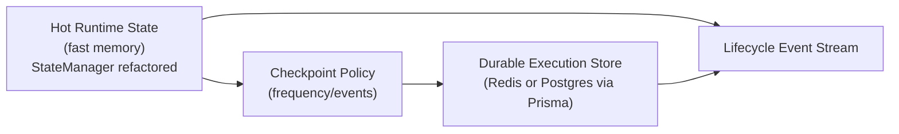
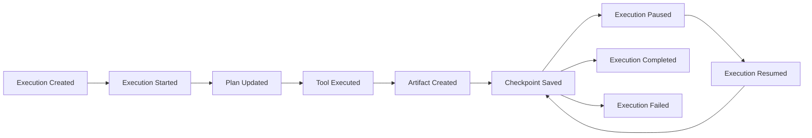

# Execution State — durable design proposal

**Status:** proposal · **Register:** [A-EXEC-003](ASSUMPTIONS.md#a-exec-003--state-management-exists-because-statemanager-exists)
**Owner:** execution model audit

Today `StateManager` is an in-memory `Map` store.
`routes/agent.ts` documents that execution state does not survive restart, does not work
multi-instance, and is not persisted. This document proposes the target.

---

## 1. Problem statement

```text
Server restarts  →  Execution disappears
```

Three concrete gaps:

1. **No durability** — a crash loses every live execution.
2. **No history** — runs are not queryable after restart (no `AgentExecution` rows).
3. **No horizontal scaling** — status/pause/cancel only work against the one process holding the
   execution.

---

## 2. Target model



### 2.1 The durable lifecycle events



> The **event stream is the durable truth**. Hot state is a cache derived from it, not a source
> of truth. This is what makes restart recovery, multi-instance, and audit possible.

---

## 3. Design decisions & alternatives

| Question | Decision | Alternatives considered | Why |
|----------|----------|-------------------------|-----|
| **Durable store** | Postgres via Prisma (existing `AgentExecution` table) | Redis-only | Postgres already exists in the stack; events + history are relational naturally. Redis optional later for hot hot-path. |
| **Source of truth** | Lifecycle **event stream** | mutable state row | Append-only is replayable, auditable, crash-safe. |
| **Hot cache** | In-memory per instance, rebuilt from events | keep `Map` as-is | Same start for fast pause/resume; correctness comes from events. |
| **Checkpoint trigger** | On every lifecycle event + explicit policy (frequency/step) | only at boundaries | Never block a step on I/O unless a checkpoint is due. |

---

## 4. Impact & blast radius

- **Add:** `AgentExecution` + `ExecutionEvent` tables (Prisma migration); an event
  writer/replayer; `StateManager` becomes a façade over the store.
- **Change:** `routes/agent.ts` status/pause/resume/cancel to read/write the store so any
  instance can serve them.
- **Defer:** cross-team scheduler (separate, see engine note).

## 5. Test

1. Start an execution, kill the server process mid-run.
2. Restart a new server instance.
3. Confirm pause/resume/history survive; confirm two instances can both observe the run.

---

## 6. Open decisions

- Event retention / compaction policy (how long do we keep full detail?).
- Whether pause/resume keeps the same model/tools snapshot across a restart.
