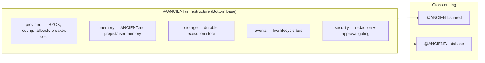

# Infrastructure layer — as-built

**Branch:** `layer/07-infrastructure` · **Status:** done (all five sub-layers wired) ·
**Register:** [A-LAYER-001](ASSUMPTIONS.md), [A-LAYER-002](ASSUMPTIONS.md)

The **bottom base** of the layered architecture (ARCHITECTURE.md §4). Everything else leans on
infrastructure; it never imports a layer above it (A-LAYER-002).

Sub-layers are added one per sub-branch under `sub/07/*`, then merged here. All five are wired:
`providers` (`8efd708`), `memory` (`06604d7`), `storage` (`0af8197`), `events` (`cdbfb83`),
`security` (`8e2035a`).

---

## Sub-01 — Providers (done)

Canonical **provider runtime**, promoted up from `server/src/lib` and made framework-agnostic,
plus NEW cost accounting:

| File | Owning responsibility |
|------|------------------------|
| `src/providers/connection.ts` | `ProviderConnection` shape + `ProviderKeyCipher` (AES-256-GCM, injectable secret, fail-fast sync key-length validation) — BYOK keys at rest. |
| `src/providers/breaker.ts` | Per-`(provider,model)` rate-limit circuit breaker (`modelKey`, `checkCooldown`, `recordRateLimitFailure`, `RateLimitCooldownError`, `isRateLimitError`). |
| `src/providers/fallback.ts` | `pickHealthyFallback` / `asFallbackCandidate` — graceful rate-limit downgrade, type-agnostic (candidates carry an opaque resolved value). |
| `src/providers/router.ts` | `classifyPrompt` / `routeTurn` — cost/token efficiency heuristic (free-first lane). |
| `src/providers/cost.ts` | `pricingFor` / `costFor` / `sumCosts` over `@ANCIENT/shared` `SUPPORTED_CHAT_MODELS` pricing — per-execution spend. |
| `src/providers/index.ts` | Public surface. |
| `src/providers/providers.test.ts` | 16 tests (router, fallback, breaker, cost, cipher). |

**Design decisions:**
- **Dependency-light** by design — only depends on `@ANCIENT/shared` (+ node builtins). Routing,
  fallback, breaker, cost, and crypto are pure and testable with no DB or AI-SDK coupling.
- **Single source of truth** for provider *data* stays in `@ANCIENT/shared` (the catalog); this
  package owns provider *behavior*. This respects A-LAYER-002 (infra imports shared, not
  vice-versa).
- **DB-backed model resolution** is intentionally NOT here — it's a storage/DB integration later
  that implements the interfaces defined here (`ProviderConnection`), keeping this layer unit-testable.

**Why promoted here:** provider/model architecture (BYOK, fallback, routing, cost) is audit order
#6 and the natural base; sharing one implementation across engine, strategies, and gateway avoids
each keeping its own router/breaker/crypto copies.

---

## Sub-02 — Memory (done)

Canonical **memory** module for the `ANCIENT.md` project/user-memory convention, ported from
`server/src/memory` and made portable:

| File | Owning responsibility |
|------|------------------------|
| `src/memory/types.ts` | `MemoryFile` / `MemoryScope` / `MemoryBudget` / `MemoryOptions`; `DEFAULT_MEMORY_BUDGET` (6k/file, 16k total). |
| `src/memory/loader.ts` | `loadMemory` (user-global → ancestor → project, highest precedence last), one-level `@import` expansion, per-file truncation, global-budget dropping; `buildMemoryPromptBlock`. |
| `src/memory/memory.test.ts` | 6 tests over temp dirs. |

Design: injectable `homedir`/`budget` for tests; depends only on node builtins — same
dependency-light rule as providers.

---

## Sub-03 — Storage (done)

Durable **execution store** that closes assumption A-EXEC-003 (the agent package's in-memory
`Map`). Implements the `EXECUTION-STATE.md` "event stream is the source of truth" model.

| File | Owning responsibility |
|------|------------------------|
| `src/storage/types.ts` | `ExecutionRecord` (projection), `LifecycleEventType`/`ExecutionEvent` (append-only durable truth), `CheckpointRecord`. |
| `src/storage/store.ts` | `ExecutionStore` interface + `EventSourcedExecutionStore` reference implementation — append-only, replayable via `applyEvent()`. |
| `src/storage/checkpoints.ts` | pure `shouldCheckpoint()` policy (every-N-seqs, always-on types, min interval) so callers never block on I/O unless a checkpoint is due. |
| `src/storage/storage.test.ts` | 9 tests (replay, completion, cost rollup, ordering, checkpoints, policy). |

A Postgres/Prisma implementation later implements the same `ExecutionStore` interface without
touching callers.

---

## Sub-04 — Events (done)

**Live** cross-layer notification ring complementing the **durable** log in Sub-03. Per
A-LAYER-002, cross-layer communication flows through this infra-owned bus.

| File | Owning responsibility |
|------|------------------------|
| `src/events/types.ts` | `LifecycleEvent` (alias of storage's `ExecutionEvent`), `EventFilter`, `Listener`, `Unsubscribe`, `BusErrorHandler`, `LogSource`. |
| `src/events/bus.ts` | `EventBus` interface + `MemoryEventBus` — sync, in-order; `subscribe`/`once`; executionId/type filters; per-listener error isolation; `close`. |
| `src/events/bridge.ts` | `createExecutionStoreBridge()` — wires a durable `LogSource` onto the bus so appends are re-published live; decoupled from any concrete store. |
| `src/events/events.test.ts` | 10 tests (ordering, filters, once, unsubscribe, isolation, close, bridge). |

Design: sync in-order delivery by design (async listeners supported, not awaited); error
isolation keeps one throwing listener from blocking peers or the publisher.

---

## Sub-05 — Security (done)

Secret containment for text streams + the **consent boundary** for risky tool calls
(ARCHITECTURE review target #8).

| File | Owning responsibility |
|------|------------------------|
| `src/security/redaction.ts` | `Redactor` — masks secrets in logs/prompts/tool output. Two pattern classes: prefixed secrets (`sk-*`, `ghp_*`, `AKIA*`, `Bearer`) and labeled `key=value` pairs (`api_key`/`token`/`password`/`secret`). Full-match `$1`-group replacements keep output readable and never re-match. Returns hit pattern names + `changed` flag. |
| `src/security/approval.ts` | `ApprovalPolicy` — `allow`/`deny`/`require-consent` across `read`/`write`/`exec`/`network`/`scope`; glob-ish target patterns (`npm run *`); one-shot `allow()` override. Pure, no I/O. |
| `src/security/security.test.ts` | 11 tests (6 redaction, 5 approval). |

Design: policy recognition is pure and deterministic; enforcement lives with the capability
runtime (layer 06). Redaction is cheap regex — usable on every emitted text stream.

## Verification

- `npm run typecheck` — exit 0 (all 6 packages incl. `infrastructure`).
- Full suite — **104 pass** (52 baseline + 52 infrastructure) as of `layer/07-infrastructure`
  (52 = 16 providers + 6 memory + 9 storage + 10 events + 11 security), 0 fail.
