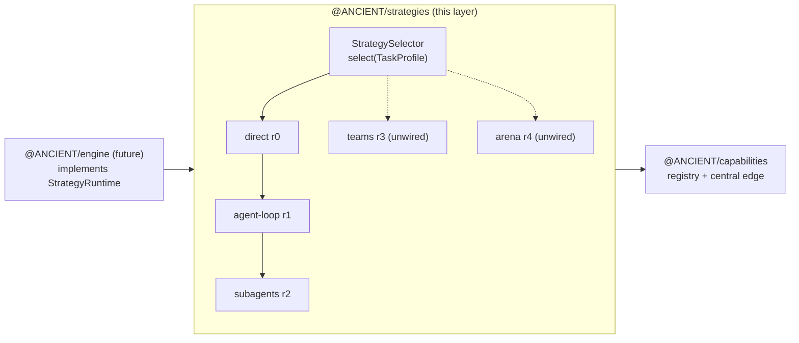

# Strategies layer — as-built

**Branch:** `layer/05-strategies` · **Status:** built (rungs 0–2 wired) ·
**Register:** [A-STRAT-001](ASSUMPTIONS.md)

Execution is a **strategy chosen from a ladder of leaves** (ARCHITECTURE.md §5). The strategy
selector is a deterministic, pure decision the engine calls; strategies receive model access +
tool execution through a `StrategyRuntime` port and never import the engine (A-LAYER-002).
`direct`(0) → `agent-loop`(1) → `subagents`(2) are wired; `teams`(3) / `arena`(4) stay
catalogued-but-unwired until the engine runtime exists.



Built in four commits on this branch (no physical sub-branches): scaffold+contracts
(`0814275`), leaves (`31459eb`), tests (`02cf46a`), assumption entry (`aa70586`).

---

## Why the ladder (not "execution = multi-agent")

ARCHITECTURE.md §3.1/§3.2 (A-EXEC-001/002) reject execution-as-multi-agent only: the cheapest
reliable strategy must drive ordinary work. The ladder makes that structural: rungs are
**cost-earned**. A trivial prompt must never spin up a subagents/teams flow (A-EXEC-002); the
selector enforces it by construction and the tests prove the unwired rungs are unreachable.

## The runtime port

`StrategyRuntime` (in `types.ts`) is the boundary the engine will implement:

```ts
type StrategyRuntime = {
  listTools(): Promise<RuntimeTool[]>;                  // already mode-gated
  runModel(input: { system?; prompt?; history?; tools? }): Promise<ModelTurnResult>;
  executeTool(call: { id; name; args }): Promise<string>;  // central edge upstream
};
```

All approval/consent/budget/redaction happen **upstream** at the capability registry's
`executeTool()` edge (A-CAP-001); strategies observe only serialized results. `execute()`
yields a `StrategyEvent` stream (`strategy-selected / text-delta / tool-call / tool-result /
subtask / error / done`) and never throws.

## The contract (`src/types.ts`)

- `STRATEGY_LADDER` = `["direct","agent-loop","subagents","teams","arena"]`; `StrategyRung` 0–4.
- `TaskProfile` — `description` + hints (`complexity`, `parallelizable`, `estimatedTokens`,
  `tools`, `mode`, `preferredStrategy`) the engine infers before turning the loop on.
- `StrategySelection` — the selector's answer (`id`, `rung`, `reason`), fully explainable.
- `ExecutionStrategy` — `id · rung · wired · match(profile) → string|null · execute(...)`;
  `wired:false` keeps teams/arena in the catalog but out of reach.

## Sub-01 — Selector (done)

Pure, deterministic, no model calls. `wantedRung` maps `complexity` (trivial/simple→0,
moderate→1, complex→2, very-complex→3) and bumps for `parallelizable` (floor 2) and
`estimatedTokens > 60k`. `selectStrategy` resolves in order: **preferred override** (wired +
within the strategy's rung ceiling) → **lowest wired rung accepting the profile** (complexity
must be earned: a complex task must actually land on `subagents`, not stall on `agent-loop`;
`direct` trusts a no-tools no-parallelism moderate task) → **cheapest wired fallback**.
Never selects an unwired strategy. `StrategySelector` wraps it (`select / listWired / has`).

## Sub-02 — direct (done)

Rung 0. Pass 1 runs the whole task (tool calls executed, results into history); pass 2 lands
the final answer **only if tools were used** — an idle re-answer turn is minted never
(never-turns-you-don't-need rule, same honesty law as the selector). Tool failures surface as
`tool-result.error`, model failures as `error`, always terminating in `done`.

## Sub-03 — agent-loop (done)

Rung 1. Iterates model↔tool until zero tool calls or the `DEFAULT_MAX_TURNS=10` budget (then
an `error` event). History carries tool results truncated at 2k chars. `match` accepts
`moderate`; preferred override extends it to any lower tier. Failures never escape the
iterator.

## Sub-04 — subagents (done)

Rung 2. Planning turn returns a bounded JSON plan (`{"subtasks":[...]}`, `extractJson` eases
fenced/prose replies, `MAX_SUBTASKS=8`); each subtask streams through a bounded
`agent-loop` with `toolCount`/`usage` rollup into the parent `done`. Accepts
`complex`/`very-complex`/`parallelizable`. Concurrency is deliberately the engine's choice —
here subtasks run sequentially and interleave as events.

## Sub-05 — Registry (done)

`strategyCatalog` (full ladder), `wiredStrategies`, and `StrategySelector`. `unwired(id, rung)`
mints catalogued placeholders whose `match` returns null and whose `execute` yields an
explicit not-wired `error` + `done`.

## Deferred until the engine (04)

`teams`(3) and `arena`(4) need the engine runtime behind them (multi-strategy orchestration,
the arena's coordinator that A-EXEC-004 still references as the target migration home for the
old forced-arena `Agent Runtime`). Until then the selector provably cannot reach them.

## Verification

- `npm run typecheck` exit 0 (strategies wired into the root chain).
- Full suite green: 210 tests, of which **31** in `packages/strategies` (selector 15, direct 4,
  agent-loop 5, subagents 4, registry 3) running wired strategies against a fake
  `StrategyRuntime` with scripted model turns.