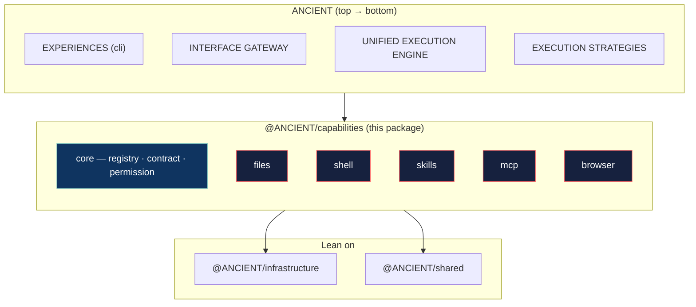
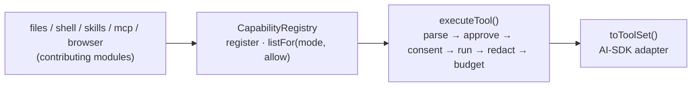

# @ANCIENT/capabilities

The **Capability Runtime** layer of ANCIENT (see `docs/ARCHITECTURE.md` §4). Owns tools,
skills, MCP, and browser/file/shell behaviors so the engine and gateway never grow a
monolithic tool stack (assumption `A-EXEC-004`, audit item #5).

Legend: green-bordered = wired; red-bordered = pending (each built in its own sub-branch under
`sub/06/*`, then merged into `layer/06-capabilities`).

---

## Engineering design

1. **Registry of atomic tools** — a capability (files, shell, skills, MCP, browser) is a
   module that *contributes `ToolDefinition`s* to the `CapabilityRegistry`. All shared
   concerns — mode gating, allow-lists, approval (`infrastructure/security`), result
   budgeting, secret redaction — are applied centrally at execute time, not per module.
2. **Framework-adjacent, not framework-bound** — the core contract is a plain object
   (`name`, `description`, zod `inputSchema`, `RiskCategory`, `execute(scope, args)`); an
   adapter emits AI-SDK `ToolSet`s for consumers like the engine/`ai`. MCP tools (which are
   not AI-SDK native) fit the same contract.
3. **Dependencies** — `@ANCIENT/shared` (schemas/models) + `@ANCIENT/infrastructure`
   (security/approval, events) only (A-LAYER-002). No upward imports.

---

## Sub-modules

### core — done (commit `a24c3a1`)

The registry + the central policy edge every tool runs through (A-CAP-001).

Files: `types.ts` (`ToolDefinition`, `ExecutionScope`, `ExecutionResult`), `registry.ts`
(`CapabilityRegistry` — mode gating defaults non-read tools out of PLAN), `execute.ts` (central
edge — approval/consent/budget/redaction, never throws), `adapters.ts` (`toToolSet`), `core.test.ts`
(17 tests).

---

## Roadmap

| Sub-layer | Status | Branch |
|-----------|--------|--------|
| `core` | done | `sub/06/01-core` |
| `files` | pending | `sub/06/02-files` |
| `shell` | pending | `sub/06/03-shell` |
| `skills` | pending | `sub/06/04-skills` |
| `mcp` | pending | `sub/06/05-mcp` |
| `browser` | pending | `sub/06/06-browser` |

Deferred to later feature branches (roadmap only, per ARCHITECTURE.md §4): `commands`,
`computer-use`, `design`, and other product-specific tool families once the engine exists.

## Verification

- `npm run typecheck` exit 0.
- Full suite green (52 baseline + per-sub additions).