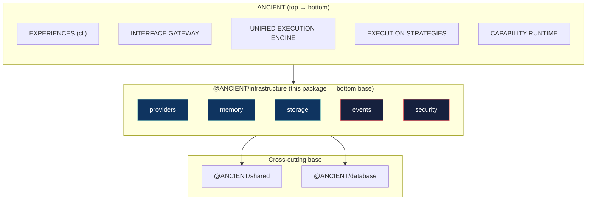
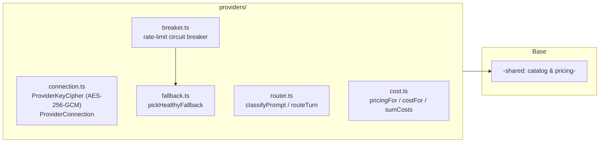
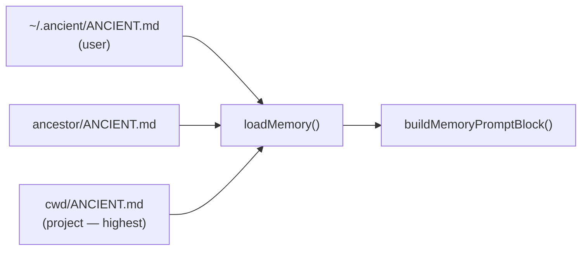
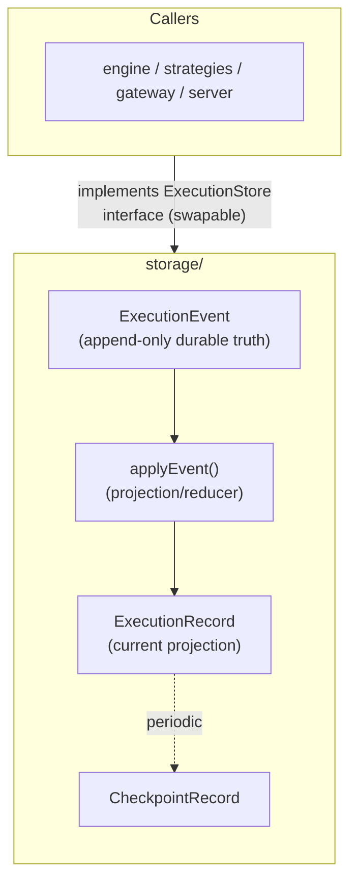

# @ANCIENT/infrastructure

The **bottom base** of the layered ANCIENT architecture (see `docs/ARCHITECTURE.md` §4). Every
other layer leans on this package; it never imports a layer above it (assumption `A-LAYER-002`).

Legend: green-bordered = wired; red-bordered = pending (built in a later sub-branch).

---

## Engineering design

Each sub-layer is an **independent module** (own directory, own exports) added behind its own
sub-branch under `sub/07/*`, then merged into `layer/07-infrastructure`. They share two rules:

1. **Dependency-light** — a sub-layer depends only on `@ANCIENT/shared` (types/data) and node
   builtins. No DB or AI-SDK coupling, so the logic is unit-testable and reusable by every layer
   above.
2. **Own behavior, not data** — provider *data* (catalog, pricing) lives in `@ANCIENT/shared`;
   infrastructure owns provider *behavior*. Shared data → infra → engine → strategies → gateway.

---

## Sub-modules

### providers — done (commit `8efd708`)

Canonical provider runtime: BYOK keys, routing, fallback, circuit breaker, cost.

Files: `connection.ts` (BYOK cipher), `breaker.ts`, `fallback.ts`, `router.ts`, `cost.ts`,
`routing-settings.ts`, `providers.test.ts` (16 tests).

### memory — done (commit `06604d7`)

Project/user memory (`ANCIENT.md`, the CLAUDE.md-equivalent) loaded into the system prompt.

Files: `types.ts`, `loader.ts` (`loadMemory`, `buildMemoryPromptBlock`), `memory.test.ts` (6 tests).

### storage — done (commit `0af8197`)

Durable **execution store** (closes assumption A-EXEC-003 — the agent package's in-memory `Map`).
The event stream is the source of truth (`EXECUTION-STATE.md`).

Files: `types.ts`, `store.ts` (`ExecutionStore` + `EventSourcedExecutionStore` sort replay),
`checkpoints.ts` (`shouldCheckpoint` policy), `storage.test.ts` (9 tests). A Postgres
implementation later implements the same interface without touching callers.

---

## Roadmap

| Sub-layer | Status | Branch |
|-----------|--------|--------|
| `providers` | done | `sub/07/01-providers` |
| `memory` | done | `sub/07/02-memory` |
| `storage` | done | `sub/07/03-storage` |
| `events` | pending | `sub/07/04-events` |
| `security` | pending | `sub/07/05-security` |

## Verification

- `npm run typecheck` exit 0.
- Full suite green (52 baseline + infrastructure additions).
