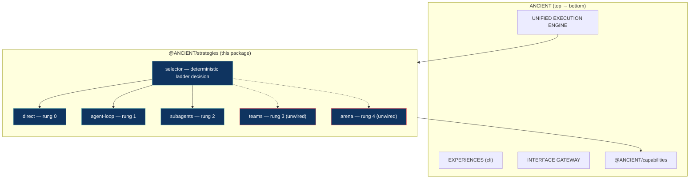

# @ANCIENT/strategies

The **Execution Strategies** layer of ANCIENT (see `docs/ARCHITECTURE.md` §5). Execution is a
strategy chosen from a ladder of *leaves* — `Direct`(0) → `Agent Loop`(1) → `Subagents`(2) →
`Teams`(3) → `Arena`(4) — picked by a deterministic, pure selector (assumption `A-STRAT-001`).
The first three rungs are wired; `teams`/`arena` are catalogued-but-unwired until the engine
runtime exists. Strategies never import the engine (A-LAYER-002): everything they need —
model turns, tool execution, the tool catalog — arrives through the `StrategyRuntime` port.

Legend: green-bordered = wired; red-bordered = catalogued but unwired (built on
`layer/05-strategies` in four commits: scaffold `0814275`, leaves `31459eb`, tests `02cf46a`,
assumption `aa70586`).

---

## Engineering design

1. **Leaves behind a pure selector** — each strategy is an `ExecutionStrategy` leaf (`id`,
   `rung`, `wired`, `match(profile)`, `execute(...) → AsyncIterable<StrategyEvent>`). The
   selector derives a `StrategySelection` from a `TaskProfile` only; it never runs a model or
   a tool. `match` is the honesty gate — a strategy may decline a profile, and the selector
   picks the **lowest wired rung that accepts** (complexity must be earned, ARCHITECTURE.md §5).
2. **Runtime as a port** — strategies take a `StrategyRuntime`
   (`listTools` / `runModel` / `executeTool`) that the engine implements (capability registry +
   model runtime). Model approval/consent/budget/redaction already happened upstream at the
   central `executeTool()` edge; strategies never re-approve.
3. **Never throws** — `execute()` yields `error` events and always terminates with a `done`
   event. Tool failures become `tool-result` events with an `error` field, not exceptions.
4. **Dependencies** — `@ANCIENT/shared` (modes/models) + `@ANCIENT/infrastructure`
   (provider `UsageTokens` only) (A-LAYER-002). No upward imports, no engine coupling.

---

## Sub-modules

### Selector — the ladder decision (`src/selector.ts`)

Pure + deterministic. `wantedRung(profile)` maps complexity (`trivial/simple`→0,
`moderate`→1, `complex`→2, `very-complex`→3), bumping for `parallelizable` (floor 2) and for
`estimatedTokens > 60k`. `selectStrategy` (1) honors an explicit `preferredStrategy` up to its
rung ceiling, falling back if unwired/unfit; (2) else picks the lowest wired rung whose
`match(profile)` accepts; (3) else the cheapest wired strategy. Never returns an unwired
strategy.

### direct — rung 0 (`src/direct.ts`)

The cheapest reliable shape: pass 1 does the whole task (tools executed, results in history);
pass 2 lands the final answer — **skipped entirely when pass 1 needed no tools** (never mint
turns you don't need). A moderate task with no tools and no parallelism is trusted to direct.
No looping.

### agent-loop — rung 1 (`src/agent-loop.ts`)

The workhorse: iterative model↔tool turns until the model stops requesting tools or the
10-turn budget( `DEFAULT_MAX_TURNS`) is reached (then an `error` event). Tool results are
pushed back as history, truncated at 2k chars. Accepts `moderate` (and anything a caller
explicitly prefers).

### subagents — rung 2 (`src/subagents.ts`)

Plan-then-delegate: a planning turn returns a bounded JSON plan
(`{"subtasks":[{"goal","context"}]}`, `extractJson` handles fenced/prose JSON, capped at
`MAX_SUBTASKS=8`); each subtask streams through a bounded agent loop with toolCount/usage
rollup. Concurrency of subtask execution is the engine's choice — here they run sequentially.
Accepts `complex`/`very-complex`/`parallelizable`.

### registry — the catalog (`src/registry.ts`)

`strategyCatalog` = the full five-rung ladder; `wiredStrategies` = the first three;
`StrategySelector` wraps `selectStrategy` with `select/listWired/has`. `teams`/`arena` are
`unwired()` placeholders: they `match` nothing, are never selected, and emit an explicit
not-wired `error` if executed directly.

---

## Roadmap — layer built; teams/arena deferred to the engine

| Leaf | Rung | Status | Notes |
|------|------|--------|-------|
| direct | 0 | wired | `src/direct.ts` |
| agent-loop | 1 | wired | `src/agent-loop.ts` |
| subagents | 2 | wired | `src/subagents.ts` |
| teams | 3 | unwired | needs the engine runtime (multi-strategy orchestration) |
| arena | 4 | unwired | target for `Agent Runtime` re-home (engine 04) |

## Verification

- `npm run typecheck` exit 0 (package included in the root chain).
- Full suite green: 210 tests total, of which 31 are `packages/strategies` (selector 15,
  direct 4, agent-loop 5, subagents 4, registry 3) against a fake `StrategyRuntime` with
  scripted model turns.